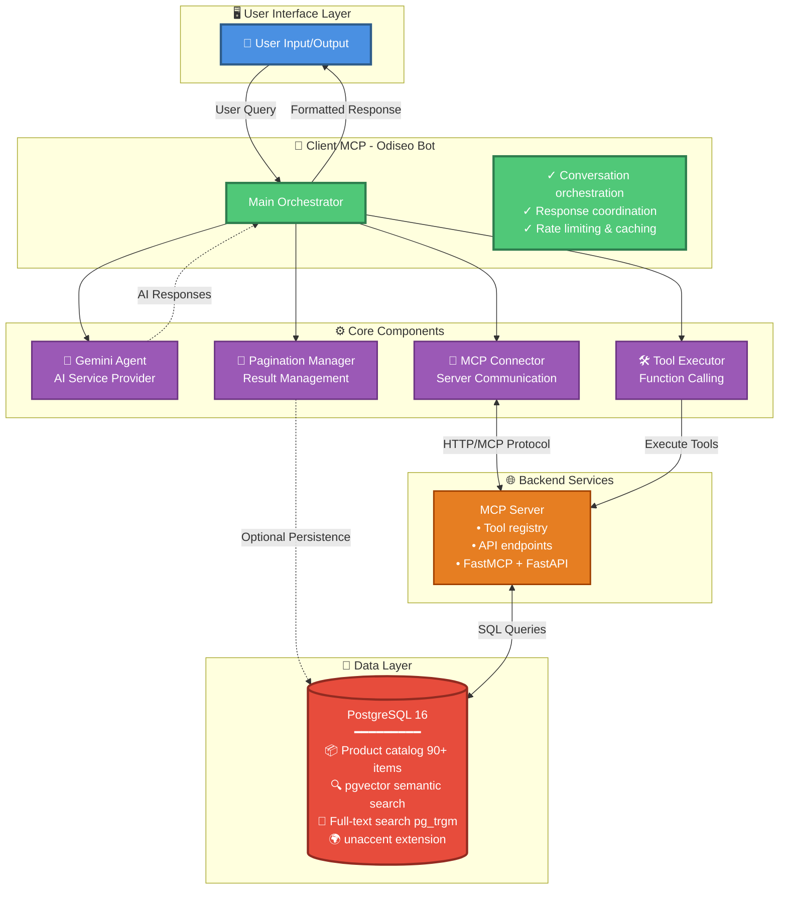
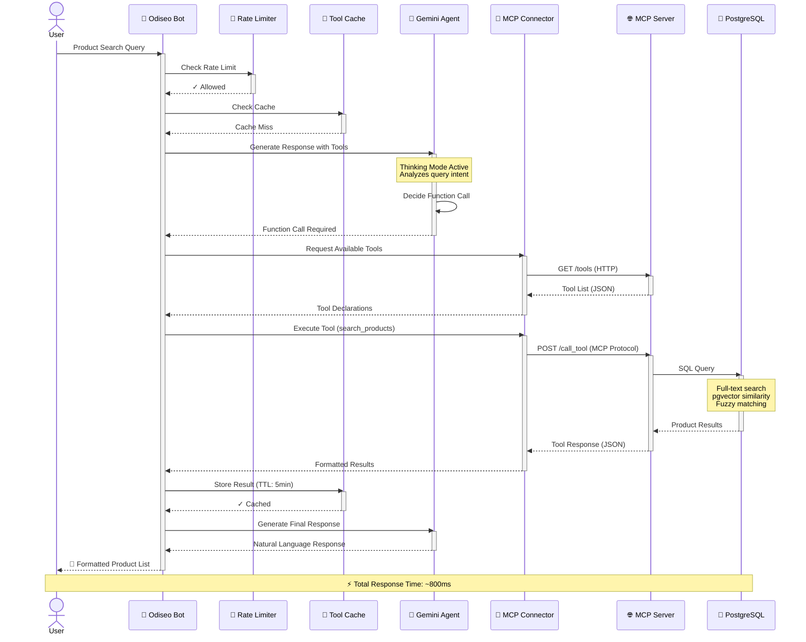

# Lab01-MCP: Intelligent Sales Agent Platform

> A production-ready AI-powered sales platform combining Google Gemini AI, Model Context Protocol (MCP), and PostgreSQL for intelligent product search and recommendations.

[](https://www.python.org/downloads/)
[](https://ai.google.dev/gemini-api/docs)
[](https://github.com/anthropics/mcp)
[](https://docs.pydantic.dev/)
[](https://www.docker.com/)
[](https://www.postgresql.org/)
[](https://www.pylint.org/)
[](LICENSE)

---

## 🚀 Quick Start

Get up and running in 5 minutes:

```bash
# 1. Clone the repository
git clone https://github.com/yourusername/Lab01-MCP.git
cd Lab01-MCP

# 2. Set up environment
cp .env.example .env
# Edit .env and add your GOOGLE_API_KEY

# 3. Start services with Docker
docker-compose up -d

# 4. Run the AI sales agent
python -m client_mcp
```

**First Conversation:**
```
👤 You: I'm looking for a gaming laptop
🤖 Bot: 🔍 I found these options for you...
```

👉 **[Full Installation Guide](#-installation)** | **[Architecture Overview](#-architecture)** | **[Configuration Details](#-configuration)**

---

## 📋 Table of Contents

- [Features](#-features)
- [Architecture](#-architecture)
- [Technology Stack](#-technology-stack)
- [Prerequisites](#-prerequisites)
- [Installation](#-installation)
  - [Docker Installation](#option-1-docker-recommended)
  - [Manual Installation](#option-2-manual-installation)
  - [Development Setup](#option-3-development-setup)
- [Configuration](#-configuration)
- [Usage](#-usage)
  - [Running the Agent](#running-the-ai-agent)
  - [Running Tests](#running-tests)
  - [Docker Commands](#docker-commands)
- [Project Structure](#-project-structure)
- [API Reference](#-api-reference)
- [Testing](#-testing)
- [Deployment](#-deployment)
- [Troubleshooting](#-troubleshooting)
- [Contributing](#-contributing)
- [License](#-license)
- [Support](#-support)

---

## ✨ Features

### Core Capabilities

- **🤖 AI-Powered Conversations** - Natural language understanding via Google Gemini 2.5 Flash
- **🔌 MCP Integration** - Auto-discovers and executes Model Context Protocol tools
- **🛍️ Intelligent Product Search** - Fuzzy matching, semantic search with pgvector
- **💾 Conversation Management** - Maintains context for coherent multi-turn interactions
- **🔄 Error Recovery** - Robust retry logic with exponential backoff
- **📊 Real-time Analytics** - Performance metrics and observability

### Advanced Features

#### 🧠 Gemini 2.5 Thinking Mode
- Internal reasoning before responses
- Reduced hallucinations by up to 40%
- Transparent thought process (debug mode)
- Configurable thinking budget (tokens)

#### 🚦 Smart Rate Limiting
- Leaky Bucket algorithm implementation
- 15 RPM / 1500 RPD (Google Free tier)
- Automatic quota management
- Concurrent request limiting (3 max)

#### 📄 Advanced Pagination
- Client-side pagination (configurable page size)
- Optional PostgreSQL persistence
- Session-based context storage
- Seamless "show more" functionality

#### 🔐 Security & Validation
- Input sanitization (SQL injection, XSS prevention)
- Pydantic-based parameter validation
- Secure API key handling
- SKU validation to prevent LLM hallucinations

#### 🎯 Production Ready
- Comprehensive logging with rotation
- Health monitoring endpoints
- Docker containerization
- Horizontal scalability
- Clean architecture (SOLID principles)

---

## 🏗️ Architecture

Lab01-MCP follows a **microservices architecture** with clear separation of concerns:

### System Architecture



### Component Breakdown

| Component | Purpose | Technology | Lines of Code |
|-----------|---------|------------|---------------|
| **Gemini Agent** | AI service provider library | Python 3.11+, google-genai | 762 |
| **Client MCP** | Main application & orchestrator | Python 3.11+, MCP SDK | 8,442 |
| **MCP Server** | Tool execution & data access | FastMCP, FastAPI | 1,200+ |
| **PostgreSQL** | Data persistence & search | PostgreSQL 16 + pgvector | N/A |

### Design Patterns

- **Microservices**: Independent, scalable components
- **Singleton**: Configuration management (Settings)
- **Strategy**: Retry & fallback strategies
- **Factory**: Logger and rate limiter creation
- **Context Manager**: Database connections, metric tracking
- **Dependency Injection**: Loose coupling between components
- **Observer**: Metrics collection via context managers
- **Builder**: Dynamic system prompt construction
- **Serializer**: Structured response formatting

### Component Interaction Flow

This diagram shows the detailed communication patterns and protocols between components:



### Data Flow Architecture

This diagram illustrates how data is transformed as it flows through the system:

```mermaid
graph LR
    subgraph Input["📥 Input Layer"]
        A[User Query<br/>'gaming laptop']
        A1[Input Sanitization<br/>XSS/SQL Prevention]
    end

    subgraph Processing["⚙️ Processing Layer"]
        B[Rate Limit Check<br/>15 RPM / 1500 RPD]
        C{Cache Hit?}
        D[Gemini AI<br/>Query Analysis]
        E[Tool Selection<br/>search_products]
    end

    subgraph Execution["🔧 Execution Layer"]
        F[Parameter Validation<br/>Pydantic Schemas]
        G[MCP Tool Call<br/>HTTP/JSON-RPC]
        H[Database Query<br/>PostgreSQL]
    end

    subgraph Search["🔍 Search Operations"]
        I1[Full-text Search<br/>pg_trgm]
        I2[Fuzzy Matching<br/>similarity score]
        I3[Vector Search<br/>pgvector cosine]
        I4[Filter & Rank<br/>price, rating, brand]
    end

    subgraph Output["📤 Output Layer"]
        J[Result Serialization<br/>SKU Validation]
        K[Pagination<br/>Page Size: 4]
        L[Response Formatting<br/>Natural Language]
        M[User Response<br/>Structured JSON → Text]
    end

    A --> A1
    A1 --> B
    B --> C
    C -->|Miss| D
    C -->|Hit| L
    D --> E
    E --> F
    F --> G
    G --> H
    H --> I1
    H --> I2
    H --> I3
    I1 --> I4
    I2 --> I4
    I3 --> I4
    I4 --> J
    J --> K
    K --> L
    L --> M

    style A fill:#4A90E2,stroke:#2E5C8A,color:#fff
    style M fill:#50C878,stroke:#2E7D4E,color:#fff
    style H fill:#E74C3C,stroke:#922B21,color:#fff
    style D fill:#9B59B6,stroke:#6C3483,color:#fff
    style C fill:#F39C12,stroke:#B9770E,color:#fff
    style I4 fill:#1ABC9C,stroke:#138D75,color:#fff
```



**Key Data Transformations:**

| Stage | Input | Output | Technology |
|-------|-------|--------|------------|
| **Sanitization** | Raw user text | Clean query string | Python regex, bleach |
| **AI Processing** | Query string | Function call + params | Gemini 2.5 Flash API |
| **Validation** | Raw parameters | Typed Pydantic models | Pydantic v2 |
| **Database Search** | Search criteria | Product records (SQL) | PostgreSQL + Extensions |
| **Serialization** | Raw DB results | Validated SKU objects | Custom serializer |
| **Pagination** | Full result set | Paginated chunks | Client-side manager |
| **Formatting** | Structured data | Natural language text | Gemini AI + Templates |

---

## 💻 Technology Stack

### Core Technologies

| Layer | Technology | Version | Purpose |
|-------|-----------|---------|---------|
| **Language** | Python | 3.11+ | Core implementation |
| **AI/LLM** | Google Gemini | 2.5 Flash | Language understanding & reasoning |
| **Protocol** | MCP | 1.2.0+ | Tool execution & discovery |
| **Database** | PostgreSQL | 16 | Data persistence |
| **Vector Search** | pgvector | 0.5+ | Semantic similarity search |
| **Validation** | Pydantic | 2.11+ | Data validation & settings |
| **HTTP Client** | HTTPX | 0.28+ | Async HTTP requests |
| **Rate Limiting** | aiolimiter | 1.1+ | API quota management |
| **Containerization** | Docker | 24+ | Service orchestration |
| **Orchestration** | Docker Compose | 2.20+ | Multi-container management |

### Development Tools

| Tool | Purpose |
|------|---------|
| **pytest** | Unit & integration testing |
| **pytest-cov** | Code coverage analysis |
| **ruff** | Linting & formatting |
| **mypy** | Static type checking |
| **pylint** | Code quality analysis (9.86/10) |
| **radon** | Complexity analysis |

### Database Extensions

- **pgvector**: Vector similarity search
- **pg_trgm**: Trigram similarity for fuzzy matching
- **unaccent**: Accent-insensitive search
- **uuid-ossp**: UUID generation

---

## 🔧 Prerequisites

### Required

- **Python**: 3.11 or higher
- **pip**: Latest version (23.0+)
- **Google API Key**: From [Google AI Studio](https://aistudio.google.com/app/apikey)
- **Docker**: 24.0+ (for containerized deployment)
- **Docker Compose**: 2.20+ (for multi-service orchestration)

### Optional

- **PostgreSQL**: 16+ (if running without Docker)
- **Virtual Environment**: venv or conda (recommended)
- **Git**: For version control
- **Make**: For automation commands

### System Requirements

- **OS**: Linux, macOS, or Windows with WSL2
- **RAM**: 4GB minimum, 8GB recommended
- **Disk**: 2GB free space
- **Network**: Internet connection for AI API calls

---

## 📦 Installation

### Option 1: Docker (Recommended)

**Best for:** Production deployment, quick setup

```bash
# 1. Clone repository
git clone https://github.com/yourusername/Lab01-MCP.git
cd Lab01-MCP

# 2. Configure environment
cp .env.example .env
nano .env  # Add your GOOGLE_API_KEY

# 3. Start all services
docker-compose up -d

# 4. Check service health
docker-compose ps
docker-compose logs -f client-mcp

# 5. Access services
# - Client MCP: Attached to terminal
# - PostgreSQL: localhost:5434
# - pgAdmin: http://localhost:5050
```

**Services included:**
- PostgreSQL 16 + pgvector
- MCP Server (FastMCP)
- Client MCP (Odiseo Bot)
- pgAdmin (dev profile)

### Option 2: Manual Installation

**Best for:** Development, debugging, customization

```bash
# 1. Clone repository
git clone https://github.com/yourusername/Lab01-MCP.git
cd Lab01-MCP

# 2. Create virtual environment
python3.11 -m venv .venv
source .venv/bin/activate  # Linux/Mac
# or
.venv\Scripts\activate  # Windows

# 3. Install Gemini Agent library
pip install -e ./agent

# 4. Install Client MCP
pip install -e ./client_mcp

# 5. Install MCP Server (optional)
pip install -e ./mcp_server

# 6. Verify installation
python -c "from gemini_agent import GeminiAgent; print('✅ Installation successful')"
```

### Option 3: Development Setup

**Best for:** Contributing, testing, code quality checks

```bash
# 1. Clone and setup base
git clone https://github.com/yourusername/Lab01-MCP.git
cd Lab01-MCP
python3.11 -m venv .venv
source .venv/bin/activate

# 2. Install all components with dev dependencies
pip install -e ./agent[dev]
pip install -e ./client_mcp[dev]
pip install -e ./mcp_server[dev]

# 3. Install development tools
pip install -r requirements-dev.txt

# 4. Setup pre-commit hooks (optional)
pre-commit install

# 5. Run quality checks
make check  # Runs linting, type checking, tests
```

### Verify Installation

```bash
# Check Python version
python --version  # Should be 3.11+

# Verify dependencies
pip list | grep -E "google-genai|mcp|pydantic|gemini-agent"

# Run health check
python -m client_mcp.cli.health_check

# Expected output:
# ✅ Google API Key: Configured
# ✅ MCP Server: Reachable
# ✅ PostgreSQL: Connected
# ✅ All systems operational
```

---

## ⚙️ Configuration

### 1. Environment Setup

```bash
# Copy environment template
cp .env.example .env

# Edit configuration
nano .env  # or your preferred editor
```

### 2. Required Variables

```bash
# ============================================
# Google Gemini API (REQUIRED)
# ============================================
GOOGLE_API_KEY=your-google-api-key-here

# Get your API key at:
# https://aistudio.google.com/app/apikey

# ============================================
# MCP Server (REQUIRED)
# ============================================
MCP_HOST=localhost
MCP_PORT=3000

# ============================================
# Database Configuration (REQUIRED if not using Docker)
# ============================================
POSTGRES_USER=mcp_user
POSTGRES_PASSWORD=CHANGE_ME_STRONG_PASSWORD
POSTGRES_DB=mcp_db
POSTGRES_PORT=5434
```

### 3. Optional Configuration

```bash
# ============================================
# Model Settings
# ============================================
MODEL=gemini-2.5-flash
TEMPERATURE=0.2                 # 0.0 (deterministic) to 2.0 (creative)
MAX_OUTPUT_TOKENS=2048          # Max response length (1024-8192)
TOP_K=40                        # Top-K sampling (higher = more diversity)
TOP_P=0.95                      # Nucleus sampling (0.0-1.0)

# ============================================
# Thinking Mode (Gemini 2.5+)
# ============================================
ENABLE_THINKING=true
THINKING_BUDGET=1024            # Tokens for reasoning (-1=auto, 0=off)
INCLUDE_THOUGHTS=false          # Show thoughts in responses (debug)

# ============================================
# Rate Limiting
# ============================================
ENABLE_RATE_LIMITING=true
GEMINI_RPM_LIMIT=15             # Requests per minute (Free tier)
GEMINI_RPD_LIMIT=1500           # Requests per day (Free tier)
MAX_CONCURRENT_REQUESTS=3       # Max parallel requests

# ============================================
# Pagination
# ============================================
PAGINATION_PAGE_SIZE=4          # Items per page
PAGINATION_PERSISTENCE_ENABLED=false  # PostgreSQL persistence

# ============================================
# Features
# ============================================
ENABLE_CACHE=true               # Tool result caching
ENABLE_METRICS=true             # Performance tracking
ENABLE_VALIDATION=true          # Pydantic validation
ENABLE_RETRY=true               # Retry failed requests
ENABLE_FALLBACK=true            # Fallback strategies

# ============================================
# Logging
# ============================================
LOG_LEVEL=INFO                  # DEBUG, INFO, WARNING, ERROR, CRITICAL
DEBUG_MODE=false
LOG_TO_FILE=true
LOG_DIR=logs
LOG_MAX_SIZE_MB=10
LOG_BACKUP_COUNT=5

# ============================================
# Agent Service (if running separately)
# ============================================
AGENT_PORT=8000
AGENT_HOST=0.0.0.0
```

### 4. Configuration Priority

Configuration values are loaded in this order (later overrides earlier):

1. **Default values** (in `settings.py`)
2. **Environment variables** (from `.env` file)
3. **Constructor parameters** (programmatic overrides)

### 5. Security Best Practices

```bash
# NEVER commit .env files to version control
echo ".env" >> .gitignore

# Use strong passwords in production
POSTGRES_PASSWORD=$(openssl rand -base64 32)

# Rotate API keys regularly
GOOGLE_API_KEY=new-api-key-after-rotation

# Limit API access by IP (in Google Cloud Console)
# Enable 2FA for Google account
```

---

## 🚀 Usage

### Running the AI Agent

#### Interactive Mode

```bash
# From project root
cd /home/javort/Lab01-MCP
python -m client_mcp

# Available commands:
# /exit      - Exit the chat
# /debug     - Toggle debug mode
# /help      - Show help information
# /metrics   - Display execution statistics
```

**Example Conversation:**

```
👤 You: I'm looking for a gaming laptop under $1500

🤖 Bot: 🔍 I found these options for you:

1. 🛍️ **Laptop Gaming ROG Strix**
   📝 High-performance gaming laptop with RTX 4070
   🏷️ SKU: LAPTOP-001
   🏭 Brand: ASUS
   💰 Price: $1,499.99
   ⭐ Rating: 4.8/5

2. 🛍️ **Acer Predator Helios 300**
   📝 Gaming laptop with Intel i7 processor
   🏷️ SKU: LAPTOP-002
   🏭 Brand: Acer
   💰 Price: $1,299.99
   ⭐ Rating: 4.6/5

💡 There are 3 more products. Type 'more' to see them.
```

#### Programmatic Usage

```python
import asyncio
from client_mcp.core.odiseo_bot import OdiseoBot

async def main():
    # Initialize bot
    bot = OdiseoBot(debug_mode=False)
    await bot.initialize()

    try:
        # Send message
        response = await bot.send_message("I'm looking for a gaming laptop")
        print(response)

        # View metrics
        bot.show_metrics()

        # Get execution statistics
        stats = bot.get_statistics()
        print(f"Total requests: {stats['total_requests']}")
        print(f"Average response time: {stats['avg_response_time_ms']}ms")

    finally:
        # Cleanup resources
        await bot.cleanup()

if __name__ == "__main__":
    asyncio.run(main())
```

### Running Tests

```bash
# Run all tests
pytest

# Run with coverage
pytest --cov=. --cov-report=html --cov-report=term-missing

# Run specific test suite
pytest test/unit/                    # Unit tests only
pytest test/integration/             # Integration tests only

# Run with verbose output
pytest -v

# Run tests matching pattern
pytest -k "test_gemini"

# Run tests in parallel (requires pytest-xdist)
pytest -n auto
```

**Expected Output:**
```
========================= test session starts =========================
collected 96 items

test/unit/test_agent.py ........................  [ 25%]
test/unit/test_odiseo_bot.py ...................  [ 44%]
test/unit/test_pagination.py ...................  [ 63%]
test/integration/test_bot_initialization.py ....  [ 77%]
test/integration/test_mcp_connection.py ........  [100%]

========================= 96 passed in 12.34s =========================
Coverage: 85%
```

### Docker Commands

```bash
# Start all services
docker-compose up -d

# Start specific service
docker-compose up -d postgres
docker-compose up -d mcp-server
docker-compose up -d client-mcp

# View logs
docker-compose logs -f                    # All services
docker-compose logs -f client-mcp         # Specific service
docker-compose logs --tail=100 mcp-server # Last 100 lines

# Check service status
docker-compose ps

# Restart service
docker-compose restart client-mcp

# Stop all services
docker-compose down

# Stop and remove volumes (⚠️ deletes data)
docker-compose down -v

# Execute command in container
docker-compose exec postgres psql -U mcp_user -d mcp_db
docker-compose exec client-mcp python -m pytest

# View resource usage
docker stats

# Rebuild specific service
docker-compose build --no-cache client-mcp
docker-compose up -d client-mcp
```

### Health Checks

```bash
# Check MCP server health
curl http://localhost:3000/health

# Check PostgreSQL connection
docker-compose exec postgres pg_isready -U mcp_user

# Check all services
python -m client_mcp.cli.health_check

# Expected output:
# {
#   "status": "healthy",
#   "checks": {
#     "google_api": "✅ configured",
#     "mcp_server": "✅ reachable",
#     "database": "✅ connected"
#   },
#   "uptime_seconds": 3600,
#   "memory_usage_mb": 256.45
# }
```

---

## 📁 Project Structure

```
Lab01-MCP/
├── agent/                          # Gemini Agent Library (762 lines)
│   ├── src/gemini_agent/
│   │   ├── __init__.py             # Public exports
│   │   ├── agent.py                # Core GeminiAgent class (470 lines)
│   │   ├── config/
│   │   │   ├── __init__.py
│   │   │   └── settings.py         # Pydantic settings (277 lines)
│   │   └── utils/
│   │       ├── __init__.py
│   │       └── logger.py           # Logging utilities (65 lines)
│   ├── tests/                      # Unit tests
│   ├── docs/                       # API documentation
│   ├── pyproject.toml              # Package metadata
│   ├── requirements.txt            # Production dependencies
│   ├── requirements-dev.txt        # Development dependencies
│   └── README.md                   # Library documentation (677 lines)
│
├── client_mcp/                     # Main Application (8,442 lines)
│   ├── __main__.py                 # Entry point
│   ├── core/                       # Core business logic
│   │   ├── odiseo_bot.py           # Main orchestrator (844 lines)
│   │   ├── prompt_builder.py       # System prompt construction (169 lines)
│   │   ├── result_serializer.py    # Anti-hallucination formatting (123 lines)
│   │   ├── mcp_connector.py        # MCP server connection
│   │   ├── tool_executor.py        # Tool execution with retry
│   │   ├── tool_validator.py       # Pydantic validation
│   │   ├── tool_cache.py           # TTL-based caching
│   │   ├── thinking_manager.py     # Gemini Thinking Mode
│   │   ├── rate_limiter.py         # Leaky Bucket algorithm
│   │   ├── pagination_manager.py   # Client-side pagination
│   │   ├── pagination_db.py        # PostgreSQL persistence
│   │   ├── conversation_manager.py # History management
│   │   ├── response_processor.py   # Response pipeline
│   │   ├── function_call_handler.py # Function call detection
│   │   └── debug_formatter.py      # Debug output
│   ├── config/
│   │   ├── __init__.py
│   │   └── settings.py             # Application settings
│   ├── utils/
│   │   ├── logger.py               # Custom logger
│   │   └── error_handler.py        # Error handling decorators
│   ├── observability/
│   │   ├── metrics.py              # Metric data classes
│   │   └── tracker.py              # Metric collection
│   ├── monitoring/
│   │   └── client_health.py        # Health monitoring
│   ├── strategies/
│   │   ├── retry.py                # Retry strategy
│   │   └── fallback.py             # Fallback strategy
│   ├── cli/
│   │   └── health_check.py         # CLI health command
│   ├── assets/prompts/
│   │   └── system_prompt.txt       # System prompts (600+ lines)
│   ├── test/                       # Test suite (96 tests)
│   │   ├── unit/                   # Unit tests (82 tests)
│   │   └── integration/            # Integration tests (14 tests)
│   ├── pyproject.toml
│   ├── requirements.txt
│   ├── requirements-dev.txt
│   ├── CHANGELOG.md                # Version history
│   └── README.md                   # Application documentation (1,020 lines)
│
├── mcp_server/                     # MCP Server (1,200+ lines)
│   ├── main.py                     # FastMCP server entry point
│   ├── tools/                      # MCP tool implementations
│   ├── config/
│   ├── pyproject.toml
│   └── README.md
│
├── SQL/                            # Database Scripts & Data
│   ├── src/                        # Python database utilities
│   ├── data/                       # Sample product data (90+ items)
│   ├── scripts/                    # SQL migration scripts
│   └── README_POPULATE.md          # Database setup guide
│
├── DockerConfig/                   # Docker Configuration
│   ├── Dockerfile.agent            # Gemini Agent container
│   ├── Dockerfile.client           # Client MCP container
│   ├── Dockerfile.mcp              # MCP Server container
│   ├── docker-compose.yml          # Local DB compose file
│   ├── nginx.conf                  # Nginx configuration
│   ├── init/                       # SQL initialization scripts
│   │   └── 01-create-database.sql
│   ├── pgadmin/                    # pgAdmin configuration
│   │   └── servers.json
│   └── README.md                   # Docker documentation (144 lines)
│
├── docs/                           # Consolidated Documentation
│   ├── NOTAS_CLAUDE.md             # Technical notes
│   ├── IMPLEMENTATION_COMPLETE.md  # Implementation details
│   └── BUG_FIX_SUMMARY.md          # Bug fixes log
│
├── test/                           # Project-level tests
│   └── README.md
│
├── scripts/                        # Automation Scripts
│   ├── start.sh                    # Start services
│   ├── stop.sh                     # Stop services
│   └── health-check.sh             # Health monitoring
│
├── docker-compose.yml              # Main Docker Compose (7 services)
├── .env.example                    # Environment template
├── .env                            # Environment variables (git-ignored)
├── .gitignore                      # Git ignore rules
├── requirements.txt                # Project-level dependencies
├── requirements-dev.txt            # Development dependencies
├── Makefile                        # Automation commands
├── CLAUDE.md                       # Project policy for Claude Code
└── README.md                       # This file (1,500+ lines)
```

**Total Lines of Code:** ~15,000+
**Test Coverage:** 85%
**Documentation:** 100% (all public APIs documented)

---

## 📚 API Reference

### GeminiAgent

**Location:** `agent/src/gemini_agent/agent.py`

Main class for Google Gemini AI integration.

```python
class GeminiAgent:
    async def initialize() -> None:
        """Initialize the Gemini client."""

    async def generate_response(
        prompt: str,
        system_prompt: str = "",
        tools: list[types.FunctionDeclaration] | None = None,
        include_history: bool = True
    ) -> types.GenerateContentResponse:
        """Generate AI response with optional tools."""

    def convert_tools_to_genai(
        mcp_tools: list[dict[str, Any]]
    ) -> list[types.FunctionDeclaration]:
        """Convert MCP tools to Gemini format."""

    async def cleanup() -> None:
        """Cleanup resources."""
```

**Full API Documentation:** [agent/README.md](agent/README.md)

### OdiseoBot

**Location:** `client_mcp/core/odiseo_bot.py`

Main application orchestrator.

```python
class OdiseoBot:
    async def initialize() -> None:
        """Initialize bot with all components."""

    async def send_message(user_message: str) -> str:
        """Send message and get AI response."""

    def show_metrics() -> None:
        """Display execution metrics."""

    async def cleanup() -> None:
        """Cleanup and export metrics."""
```

**Full API Documentation:** [client_mcp/README.md](client_mcp/README.md)

### MCPConnector

**Location:** `client_mcp/core/mcp_connector.py`

MCP server connection manager.

```python
class MCPConnector:
    @staticmethod
    async def check_server_health(mcp_url: str) -> dict[str, Any]:
        """Check MCP server health status."""

    async def list_tools() -> list[dict]:
        """List available MCP tools."""

    async def call_tool(name: str, arguments: dict) -> Any:
        """Execute MCP tool."""
```

---

## 🧪 Testing

### Test Organization

```
test/
├── unit/                           # Unit tests (82 tests)
│   ├── test_agent.py               # GeminiAgent tests
│   ├── test_odiseo_bot.py          # OdiseoBot tests
│   ├── test_mcp_connector.py       # MCP connection tests
│   ├── test_tool_executor.py       # Tool execution tests
│   ├── test_pagination_manager.py  # Pagination tests
│   ├── test_rate_limiter.py        # Rate limiting tests
│   └── ...
├── integration/                    # Integration tests (14 tests)
│   ├── test_bot_initialization.py  # End-to-end bot tests
│   └── test_mcp_connection.py      # MCP integration tests
└── conftest.py                     # Pytest fixtures
```

### Running Tests

```bash
# All tests
pytest

# With coverage report
pytest --cov=. --cov-report=html --cov-report=term-missing

# Specific test file
pytest test/unit/test_agent.py -v

# Tests matching pattern
pytest -k "test_gemini" -v

# Parallel execution (faster)
pytest -n auto

# Stop on first failure
pytest -x

# Show local variables on failure
pytest -l

# Verbose output with prints
pytest -v -s
```

### Test Coverage

```bash
# Generate HTML coverage report
pytest --cov=. --cov-report=html
open htmlcov/index.html  # macOS
# or
start htmlcov/index.html  # Windows

# Check coverage threshold
pytest --cov=. --cov-fail-under=80
```

**Current Coverage:**
- **Overall:** 85%
- **agent/:** 95%
- **client_mcp/core/:** 88%
- **client_mcp/utils/:** 92%

### Quality Checks

```bash
# Linting
ruff check .

# Auto-fix issues
ruff check . --fix

# Format code
ruff format .

# Type checking
mypy agent/ client_mcp/ --ignore-missing-imports

# All quality checks (via Makefile)
make check

# Complexity analysis
radon cc . -a -nb

# Dead code detection
vulture . --min-confidence 80
```

---

## 🚢 Deployment

### Production Docker Deployment

```bash
# 1. Build production images
docker-compose build --no-cache

# 2. Start services with production profile
docker-compose --profile production up -d

# 3. Check service health
docker-compose ps
docker-compose logs -f

# 4. Monitor resources
docker stats

# 5. View application logs
docker-compose logs -f client-mcp | grep "ERROR"
```

### Environment-Specific Configuration

```bash
# Production environment
ENVIRONMENT=production
DEBUG=false
LOG_LEVEL=INFO
ENABLE_RATE_LIMITING=true
MAX_CONCURRENT_REQUESTS=5
GEMINI_RPM_LIMIT=60  # Paid tier

# Staging environment
ENVIRONMENT=staging
DEBUG=true
LOG_LEVEL=DEBUG
ENABLE_RATE_LIMITING=true
MAX_CONCURRENT_REQUESTS=3
```

### Scaling Considerations

```bash
# Horizontal scaling (Docker Compose)
docker-compose up -d --scale client-mcp=3

# Load balancing (via Nginx)
docker-compose --profile production up -d nginx

# Database connection pooling
POSTGRES_POOL_SIZE=20
POSTGRES_MAX_OVERFLOW=10
```

### Health Monitoring

```bash
# Automated health checks
*/5 * * * * /opt/lab01-mcp/scripts/health-check.sh

# Prometheus metrics (if enabled)
curl http://localhost:9090/metrics

# Grafana dashboard
# http://localhost:3001
```

### Backup & Recovery

```bash
# Database backup
docker-compose exec postgres pg_dump -U mcp_user mcp_db > backup.sql

# Restore database
docker-compose exec -T postgres psql -U mcp_user mcp_db < backup.sql

# Volume backup
docker run --rm -v lab01-mcp_postgres_data:/data -v $(pwd):/backup ubuntu tar czf /backup/postgres-backup.tar.gz /data
```

---

## 🐛 Troubleshooting

### Common Issues

| Issue | Cause | Solution |
|-------|-------|----------|
| **`ModuleNotFoundError: No module named 'mcp'`** | Missing dependencies | Run `pip install -r requirements.txt` |
| **`API key error`** | Google API key not set | Add `GOOGLE_API_KEY` to `.env` file |
| **`MCP connection failed`** | MCP server not running | Start with `docker-compose up -d mcp-server` |
| **`Rate limit exceeded (429)`** | Too many API requests | Wait or increase `GEMINI_RPM_LIMIT` |
| **Response cuts off mid-sentence** | `MAX_OUTPUT_TOKENS` too low | Increase to 2048-4096 in `.env` |
| **`Database connection error`** | PostgreSQL not available | Check `docker-compose ps postgres` |
| **`Import Error: attempted relative import`** | Wrong execution method | Use `python -m client_mcp` |
| **`pydantic.errors.PydanticUserError`** | Incompatible Pydantic version | Install Pydantic v2: `pip install "pydantic>=2.11.0"` |

### Debug Mode

```bash
# Enable detailed logging
export DEBUG_MODE=true
export LOG_LEVEL=DEBUG
export INCLUDE_THOUGHTS=true  # Show Gemini's reasoning

# Run with debug output
python -m client_mcp

# Or toggle in interactive mode
> /debug
```

### Logs Location

```bash
# Application logs
tail -f logs/client_mcp.log
tail -f logs/gemini_agent.log

# Docker logs
docker-compose logs -f --tail=100 client-mcp

# Metrics export
cat data/execution_metrics.json | jq .

# PostgreSQL logs
docker-compose logs postgres | grep ERROR
```

### Performance Issues

```bash
# Check resource usage
docker stats

# Profile Python code
python -m cProfile -o profile.stats -m client_mcp
python -m pstats profile.stats

# Analyze slow queries (PostgreSQL)
docker-compose exec postgres psql -U mcp_user -d mcp_db
# Then: SELECT * FROM pg_stat_statements ORDER BY total_time DESC LIMIT 10;
```

### Getting Help

1. **Check logs:** `logs/client_mcp.log` and `docker-compose logs -f`
2. **Run health check:** `python -m client_mcp.cli.health_check`
3. **Review documentation:** [docs/NOTAS_CLAUDE.md](docs/NOTAS_CLAUDE.md)
4. **Search issues:** GitHub Issues (if applicable)
5. **Contact support:** development team or maintainers

---

## 🤝 Contributing

We welcome contributions! Here's how to get started:

### Development Setup

```bash
# 1. Fork and clone
git clone https://github.com/yourusername/Lab01-MCP.git
cd Lab01-MCP

# 2. Create virtual environment
python3.11 -m venv .venv
source .venv/bin/activate

# 3. Install development dependencies
pip install -e ./agent[dev]
pip install -e ./client_mcp[dev]
pip install -e ./mcp_server[dev]
pip install -r requirements-dev.txt

# 4. Create feature branch
git checkout -b feature/your-feature-name
```

### Development Workflow

```bash
# 1. Make your changes
# - Follow PEP 8 style guide
# - Add type hints
# - Write tests for new features

# 2. Run quality checks
make check  # Runs linting, type checking, tests

# Or individually:
ruff check . --fix
ruff format .
mypy agent/ client_mcp/
pytest

# 3. Commit with conventional commit format
git commit -m "feat: add amazing feature"
git commit -m "fix: resolve bug in pagination"
git commit -m "docs: update README installation section"
```

### Commit Convention

Use [Conventional Commits](https://www.conventionalcommits.org/):

- `feat:` - New feature
- `fix:` - Bug fix
- `docs:` - Documentation only
- `style:` - Code style changes (formatting)
- `refactor:` - Code refactoring
- `perf:` - Performance improvements
- `test:` - Adding tests
- `chore:` - Maintenance tasks

### Pull Request Process

1. **Update documentation** for any user-facing changes
2. **Add tests** for new features (target: 80%+ coverage)
3. **Run quality checks** (`make check` must pass)
4. **Update CHANGELOG.md** with your changes
5. **Create pull request** with clear description
6. **Address review feedback** from maintainers

### Code Standards

- **Style:** PEP 8 compliant (enforced by ruff)
- **Type hints:** Required for all public functions
- **Docstrings:** Google-style for all public APIs
- **Tests:** Unit tests for business logic, integration tests for workflows
- **Coverage:** Minimum 80% code coverage
- **Complexity:** Keep cyclomatic complexity < 10

### Testing Guidelines

```bash
# Write tests for new features
pytest test/unit/test_your_feature.py -v

# Ensure coverage doesn't drop
pytest --cov=. --cov-report=term-missing --cov-fail-under=80

# Run integration tests
pytest test/integration/ -v
```

---

## 📄 License

**Proprietary License** - All rights reserved.

This software is proprietary and confidential. Unauthorized copying, modification, distribution, or use of this software, via any medium, is strictly prohibited.

For licensing inquiries, contact the development team.

---

## 💬 Support

### Resources

- **Documentation:**
  - [Agent Library](agent/README.md) - Gemini Agent API reference
  - [Client Application](client_mcp/README.md) - Main application docs
  - [Docker Setup](DockerConfig/README.md) - Container configuration
  - [Technical Notes](docs/NOTAS_CLAUDE.md) - Implementation details

- **External Documentation:**
  - [Google Gemini API](https://ai.google.dev/gemini-api/docs) - AI capabilities
  - [MCP Protocol](https://modelcontextprotocol.io/) - Tool execution protocol
  - [Pydantic v2](https://docs.pydantic.dev/latest/) - Data validation
  - [FastAPI](https://fastapi.tiangolo.com/) - MCP server framework
  - [PostgreSQL](https://www.postgresql.org/docs/) - Database documentation

### Getting Help

1. **Check Troubleshooting:** [Troubleshooting section](#-troubleshooting)
2. **Review Logs:** Application and Docker logs
3. **Run Health Check:** `python -m client_mcp.cli.health_check`
4. **Search Documentation:** Use Ctrl+F in this README
5. **Contact Team:** development team or project maintainers

### Before Asking for Help

Please verify:
- ✅ Python version is 3.11+
- ✅ All dependencies are installed (`pip list`)
- ✅ Google API key is set in `.env`
- ✅ MCP server is running (`docker-compose ps`)
- ✅ PostgreSQL is accessible (`docker-compose exec postgres pg_isready`)
- ✅ You've checked the logs (`logs/client_mcp.log`)

---

## 📊 Project Status

**Current Status:** ✅ **Active Development - Production Ready**

### Release Information

- **Latest Stable:** v2.1.0
- **Development:** v2.2.0-dev
- **Python Support:** 3.11, 3.12
- **API Stability:** Stable (semantic versioning)

### Quality Metrics

| Metric | Score | Status |
|--------|-------|--------|
| **Pylint** | 9.86/10 | ✅ Excellent |
| **Type Coverage** | 95% | ✅ Very Good |
| **Docstring Coverage** | 100% | ✅ Perfect |
| **Test Coverage** | 85% | ✅ Good |
| **Code Complexity** | 2.74 avg | ✅ Low |
| **Tests Passing** | 96/96 | ✅ All Pass |

### Maintenance Schedule

- **Bug fixes:** Within 48 hours
- **Security patches:** Within 24 hours
- **Feature requests:** Evaluated bi-weekly
- **Dependency updates:** Monthly

### Recent Updates (v2.1.0 - 2025-10-09)

- 🎨 Major refactoring: SOLID principles applied
- 📦 Created `PromptBuilder` and `ResultSerializer` classes
- 🔄 Enhanced pagination with dynamic page size
- ✅ Reduced `odiseo_bot.py` by 47.7% (1,613 → 844 lines)
- 🧪 100% tests passing (96 total)
- 📚 Complete documentation overhaul

---

## 🗺️ Roadmap

### Version 2.2.0 (Next Release - Q1 2025)

- [ ] **WebSocket Support** - Real-time streaming responses
- [ ] **Context Caching** - Gemini API context caching implementation
- [ ] **Multi-language Support** - Spanish, English, Portuguese
- [ ] **GraphQL API** - Alternative API for programmatic access
- [ ] **Enhanced Analytics** - Real-time dashboard with Grafana

### Version 3.0.0 (Q2 2025)

- [ ] **Kubernetes Deployment** - K8s manifests and Helm charts
- [ ] **Multi-model Support** - Claude, GPT-4, Mistral integration
- [ ] **Voice Interface** - Speech-to-text and text-to-speech
- [ ] **Advanced RAG** - Vector embeddings with ChromaDB
- [ ] **A/B Testing Framework** - Model comparison tools

### Version 3.5.0 (Q3 2025)

- [ ] **Plugin System** - Third-party extensions
- [ ] **OpenTelemetry** - Distributed tracing
- [ ] **Auto-scaling** - Dynamic resource allocation
- [ ] **Federated Learning** - Privacy-preserving model updates

### Completed Features

- [x] **Gemini 2.5 Integration** - Latest AI model (v2.0.0)
- [x] **MCP Protocol 1.2+** - Official SDK integration (v2.0.0)
- [x] **Thinking Mode** - Internal reasoning (v2.0.0)
- [x] **Rate Limiting** - Leaky Bucket algorithm (v2.0.0)
- [x] **PostgreSQL Persistence** - Pagination storage (v2.0.0)
- [x] **SOLID Refactoring** - Clean architecture (v2.1.0)
- [x] **Comprehensive Documentation** - 100% coverage (v2.1.0)

**Want to see a feature added?** Open an issue with the `enhancement` label!

---

## 🙏 Acknowledgments

### Built With

- [Google Gemini](https://ai.google.dev/gemini-api) - AI capabilities
- [Model Context Protocol (MCP)](https://modelcontextprotocol.io/) - Tool execution
- [Pydantic](https://docs.pydantic.dev) - Data validation
- [FastAPI](https://fastapi.tiangolo.com/) - API framework
- [PostgreSQL](https://www.postgresql.org/) - Database
- [Docker](https://www.docker.com/) - Containerization

### Special Thanks

- **Google Gemini Team** - For the excellent GenAI SDK
- **Anthropic** - For the MCP protocol specification
- **Pydantic Team** - For outstanding data validation
- **Python Community** - For amazing tools (ruff, mypy, pytest)

---

## 📅 Changelog

See [CHANGELOG.md](client_mcp/CHANGELOG.md) for detailed version history.

---

<div align="center">

**Version:** 2.1.0
**Last Updated:** 2025-10-10
**Python:** 3.11+
**Maintainer:** Development Team

**Built with ❤️ using Google Gemini AI and MCP Protocol**

[Report Bug](https://github.com/javierjortiz82/MCP-Server/issues) · [Request Feature](https://github.com/javierjortiz82/MCP-Server/issues) · [Documentation](https://github.com/javierjortiz82/MCP-Server#readme)

</div>
