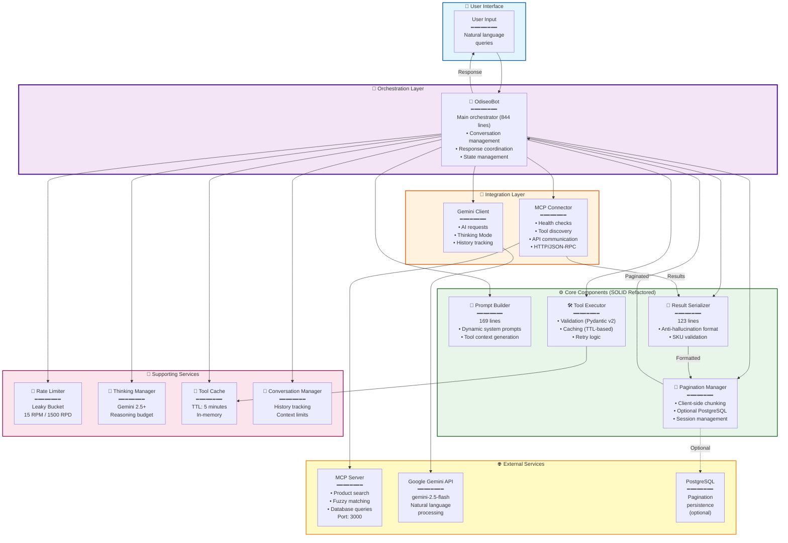

# SmartBot MCP Client - Odiseo Bot

[](https://www.python.org/downloads/)
[](https://ai.google.dev/gemini-api/docs)
[](https://github.com/anthropics/mcp)
[](https://docs.pydantic.dev/)
[](https://github.com/astral-sh/ruff)
[](LICENSE)
[]()
[]()

> **Intelligent sales agent powered by Google Gemini AI and Model Context Protocol (MCP)**

SmartBot is an advanced conversational AI agent that combines Google Gemini's language understanding with MCP's tool execution capabilities to provide intelligent product search, recommendations, and customer assistance.

---

## 🚀 Quick Start

Get up and running in 3 minutes:

```bash
# 1. Clone and navigate
cd /path/to/Lab01-MCP/client_mcp

# 2. Create virtual environment
python3 -m venv .venv
source .venv/bin/activate  # Windows: .venv\Scripts\activate

# 3. Install dependencies
pip install -r requirements.txt

# 4. Configure environment
cp .env.example .env
# Edit .env and add your GOOGLE_API_KEY

# 5. Run the bot
python -m client_mcp
```

**First Conversation:**
```
👤 You: Busco una laptop gaming
🤖 Bot: 🔍 Encontré estas opciones para ti...
```

👉 **[Full Installation Guide](#-installation)** | **[Configuration Details](#-configuration)**

---

## 📋 Table of Contents

- [Features](#-features)
- [Quick Start](#-quick-start)
- [Prerequisites](#-prerequisites)
- [Installation](#-installation)
- [Configuration](#-configuration)
- [Usage](#-usage)
- [Testing](#-testing)
- [Deployment](#-deployment)
- [Architecture](#-architecture)
- [Technology Stack](#-technology-stack)
- [API Reference](#-api-reference)
- [Troubleshooting](#-troubleshooting)
- [Contributing](#-contributing)
- [License](#-license)

---

## ✨ Features

### Core Capabilities
- **🤖 AI-Powered Conversations**: Natural language understanding via Google Gemini 2.5 Flash
- **🔌 MCP Integration**: Auto-discovers and executes Model Context Protocol tools
- **🛍️ Product Search**: Intelligent product recommendations with fuzzy matching
- **💬 Context Memory**: Maintains conversation history for coherent interactions
- **🔄 Error Recovery**: Robust retry logic with exponential backoff

### Advanced Features
- **🧠 Thinking Mode** (Gemini 2.5+)
  - Internal reasoning before responses
  - Reduced hallucinations
  - Transparent thought process (debug mode)

- **🚦 Rate Limiting**
  - Leaky Bucket algorithm
  - 15 RPM / 1500 RPD (Google Free tier)
  - Automatic quota management
  - Concurrent request limiting (3 max)

- **📊 Observability & Metrics**
  - Tool execution tracking
  - Performance analytics
  - Health monitoring
  - JSON metrics export

- **📄 Pagination Management**
  - Client-side pagination (4 items/page)
  - Optional PostgreSQL persistence
  - Session-based context storage

- **🔐 Security Features**
  - Input sanitization (SQL injection, XSS prevention)
  - Pydantic-based parameter validation
  - Secure API key handling with `getpass`
  - SKU validation to prevent LLM hallucinations

---

## 🔧 Prerequisites

### Required
- **Python**: 3.10 or higher
- **pip**: Latest version
- **Google API Key**: From [Google AI Studio](https://aistudio.google.com/app/apikey)

### Optional
- **PostgreSQL**: 12+ (for pagination persistence)
- **MCP Server**: Running on localhost:8009 (auto-configured)

### Recommended
- **Virtual environment**: venv or conda
- **OS**: Linux, macOS, or Windows with WSL2

---

## 📦 Installation

### Option 1: Automated Installation (Recommended)

```bash
# Clone the repository
cd /path/to/Lab01-MCP/client_mcp

# Run automated installer
./install.sh
```

### Option 2: Manual Installation

```bash
# Create virtual environment
python3 -m venv .venv
source .venv/bin/activate  # On Windows: .venv\Scripts\activate

# Upgrade pip
pip install --upgrade pip

# Install dependencies
pip install -r requirements.txt

# Install dev dependencies (optional)
pip install -r requirements-dev.txt
```

### Option 3: Using pip (if published)

```bash
pip install smartbot-mcp-client
```

### Verify Installation

```bash
# Check Python version
python --version  # Should be 3.10+

# Verify dependencies
pip list | grep -E "google-genai|mcp|pydantic"

# Run health check
python -m client_mcp.cli.health_check
```

---

## ⚙️ Configuration

### 1. Environment Setup

```bash
# Copy environment template
cp .env.example .env

# Edit configuration
nano .env  # or your preferred editor
```

### 2. Required Variables

```bash
# Google Gemini API (REQUIRED)
GOOGLE_API_KEY=your-google-api-key-here

# MCP Server (REQUIRED)
MCP_HOST=localhost
MCP_PORT=8009
```

**Get Google API Key:**
1. Visit [Google AI Studio](https://aistudio.google.com/app/apikey)
2. Create new API key
3. Copy and paste into `.env` file

### 3. Optional Configuration

```bash
# Model Settings
MODEL=gemini-2.5-flash
TEMPERATURE=0.2
MAX_OUTPUT_TOKENS=2048  # Allows complete multi-category responses (range: 1024-8192)
TOP_K=40
TOP_P=0.95

# Thinking Mode (Gemini 2.5+)
ENABLE_THINKING=true
THINKING_BUDGET=1024        # Tokens for reasoning (-1=auto, 0=off)
INCLUDE_THOUGHTS=false      # Show thoughts in responses (debug)

# Rate Limiting
ENABLE_RATE_LIMITING=true
GEMINI_RPM_LIMIT=15         # Requests per minute
GEMINI_RPD_LIMIT=1500       # Requests per day
MAX_CONCURRENT_REQUESTS=3

# Pagination Persistence (Optional PostgreSQL)
PAGINATION_PERSISTENCE_ENABLED=false
PAGINATION_DB_HOST=localhost
PAGINATION_DB_PORT=5434
PAGINATION_DB_NAME=mcpdb
PAGINATION_DB_USER=mcp_user
PAGINATION_DB_PASSWORD=your-db-password

# Features
ENABLE_CACHE=true
ENABLE_METRICS=true
ENABLE_VALIDATION=true
ENABLE_RETRY=true
ENABLE_FALLBACK=true

# Logging
LOG_LEVEL=INFO              # DEBUG, INFO, WARNING, ERROR
DEBUG_MODE=false
```

**Security Note**: Never commit `.env` files to version control. The `.env` file is already in `.gitignore`.

---

## 🚀 Usage

### Interactive Mode

```bash
# From project root
python -m client_mcp

# Or using the run script
./run.sh
```

**Available Commands:**
- `/exit` - Exit the chat
- `/debug` - Toggle debug mode (shows tool calls & metrics)
- `/help` - Show help information
- `/metrics` - Display execution statistics

**Example Conversation:**
```
👤 You: Busco una laptop gaming

🤖 Bot: 🔍 Encontré estas opciones para ti:

1. 🛍️ **Laptop Gaming ROG Strix**
   📝 Portátil gaming de alto rendimiento con RTX 4070
   🏷️ SKU: LAPTOP-001
   🏭 Marca: ASUS
   💰 Precio: $1,499.99

2. 🛍️ **Acer Predator Helios 300**
   📝 Gaming laptop con procesador Intel i7
   🏷️ SKU: LAPTOP-002
   🏭 Marca: Acer
   💰 Precio: $1,299.99

💡 Quedan 3 productos más. Escribe 'más' para verlos.
```

### Programmatic Usage

```python
import asyncio
from client_mcp.core.odiseo_bot import OdiseoBot

async def main():
    # Initialize bot
    bot = OdiseoBot(debug_mode=False)
    await bot.initialize()

    try:
        # Send message
        response = await bot.send_message("Busco una laptop gaming")
        print(response)

        # View metrics
        bot.show_metrics()

    finally:
        # Cleanup resources
        await bot.cleanup()

if __name__ == "__main__":
    asyncio.run(main())
```

### Health Check

```python
from client_mcp.monitoring.client_health import run_health_check

async def check_health():
    health = await run_health_check()
    print(f"Status: {health['status']}")
    print(f"Checks: {health['checks']}")
    print(f"Uptime: {health['uptime_seconds']}s")
    print(f"Memory: {health['memory_usage_mb']:.2f} MB")
```

---

## 🧪 Testing

### Run All Tests

```bash
# Unit tests only
pytest test/unit/ -v

# Integration tests
pytest test/integration/ -v

# All tests with coverage
pytest test/ --cov=. --cov-report=html --cov-report=term-missing
```

### Current Test Results

```bash
# ✅ Integration Tests: 14/14 PASSED (100%)
pytest test/integration/test_bot_initialization.py -v

# ✅ Unit Tests: 82/82 PASSED (100%)
pytest test/unit/ -v
```

### Test Coverage

```bash
# Generate coverage report
pytest test/ --cov=. --cov-report=html

# View report
open htmlcov/index.html  # On macOS/Linux
# or
start htmlcov/index.html  # On Windows
```

### Code Quality Checks

```bash
# Linting with ruff
ruff check . --fix

# Format code
ruff format .

# Type checking
mypy client_mcp/ --ignore-missing-imports

# Run all checks
ruff check . --fix && ruff format . && mypy client_mcp/
```

---

## 🚢 Deployment

### Production Environment

#### 1. Environment Variables

```bash
# Set production environment variables
export GOOGLE_API_KEY="your-production-api-key"
export MCP_HOST="production-mcp-server.example.com"
export MCP_PORT="8009"
export LOG_LEVEL="INFO"
export DEBUG_MODE="false"
export ENABLE_METRICS="true"
export ENABLE_RATE_LIMITING="true"
```

#### 2. Using Docker (Recommended)

```bash
# Build image
docker build -t smartbot-mcp-client:latest -f DockerConfig/Dockerfile.client .

# Run container
docker run -d \
  --name smartbot-client \
  --env-file .env \
  --network lab01_network \
  smartbot-mcp-client:latest
```

#### 3. Using Docker Compose

```bash
# From project root
docker-compose up -d client-mcp

# View logs
docker-compose logs -f client-mcp

# Stop service
docker-compose down
```

#### 4. Process Manager (systemd)

Create `/etc/systemd/system/smartbot-client.service`:

```ini
[Unit]
Description=SmartBot MCP Client
After=network.target postgresql.service

[Service]
Type=simple
User=smartbot
WorkingDirectory=/opt/smartbot/client_mcp
Environment="PATH=/opt/smartbot/.venv/bin"
EnvironmentFile=/opt/smartbot/client_mcp/.env
ExecStart=/opt/smartbot/.venv/bin/python -m client_mcp
Restart=always
RestartSec=10

[Install]
WantedBy=multi-user.target
```

Enable and start:
```bash
sudo systemctl daemon-reload
sudo systemctl enable smartbot-client
sudo systemctl start smartbot-client
sudo systemctl status smartbot-client
```

### Performance Optimization

```bash
# Production settings in .env
ENABLE_CACHE=true
CACHE_TTL_SECONDS=600.0
RETRY_MAX_ATTEMPTS=5
ENABLE_VALIDATION=true
MAX_CONCURRENT_REQUESTS=5
GEMINI_RPM_LIMIT=60  # If using paid tier
```

### Monitoring & Logging

```bash
# View application logs
tail -f logs/client_mcp.log

# Export metrics
cat data/execution_metrics.json | jq .

# Health check endpoint (if enabled)
curl http://localhost:8080/health
```

---

## 🏗️ Architecture

### High-Level Overview

SmartBot follows a **modular, SOLID-principles architecture** with clear separation of concerns:



### Project Structure

```
client_mcp/
├── __main__.py                  # Entry point (python -m client_mcp)
├── __init__.py                  # Package initialization
│
├── core/                        # Core business logic (REFACTORED)
│   ├── odiseo_bot.py            # Main orchestrator (844 lines, -47.7% reduction)
│   ├── prompt_builder.py        # 🆕 System prompt construction (169 lines)
│   ├── result_serializer.py    # 🆕 Anti-hallucination formatting (123 lines)
│   ├── mcp_connector.py         # MCP server connection & health checks
│   ├── tool_executor.py         # Tool execution with retry/fallback
│   ├── tool_validator.py        # Pydantic-based parameter validation
│   ├── tool_cache.py            # TTL-based tool result caching
│   ├── thinking_manager.py      # Gemini 2.5 Thinking Mode manager
│   ├── rate_limiter.py          # Leaky Bucket rate limiter
│   ├── pagination_manager.py    # Client-side pagination + DB persistence
│   ├── pagination_db.py         # PostgreSQL persistence layer
│   ├── conversation_manager.py  # Conversation history management
│   ├── gemini_client.py         # Google GenAI client wrapper
│   ├── response_validator.py    # Response validation logic
│   ├── response_processor.py    # Response processing pipeline
│   ├── function_call_handler.py # Function call detection & handling
│   └── debug_formatter.py       # Debug output formatting
│
├── config/                      # Configuration management
│   ├── settings.py              # Pydantic BaseSettings v2 (Singleton)
│   └── __init__.py
│
├── utils/                       # Utility modules
│   ├── logger.py                # Custom logger with rotation & emojis
│   ├── error_handler.py         # Decorators for error handling
│   └── __init__.py
│
├── observability/               # Metrics and tracking
│   ├── metrics.py               # ToolMetric data classes
│   ├── tracker.py               # Metric collection & context manager
│   └── __init__.py
│
├── monitoring/                  # Health checks
│   ├── client_health.py         # Application health monitoring
│   └── __init__.py
│
├── strategies/                  # Strategy pattern implementations
│   ├── retry.py                 # Exponential backoff retry strategy
│   ├── fallback.py              # Tool fallback strategy
│   └── __init__.py
│
├── cli/                         # Command-line interface
│   ├── health_check.py          # CLI health check command
│   └── __init__.py
│
├── assets/                      # Static resources
│   └── prompts/                 # System prompts (600+ lines)
│       └── system_prompt.txt
│
├── test/                        # Test suite
│   ├── unit/                    # Unit tests (20 files, 82 tests)
│   ├── integration/             # Integration tests (2 files, 14 tests)
│   └── conftest.py              # Pytest fixtures
│
├── requirements.txt             # Production dependencies
├── requirements-dev.txt         # Development dependencies
├── pyproject.toml               # Package metadata & tool config
├── ruff.toml                    # Ruff linter configuration
├── .env.example                 # Environment template
├── .gitignore                   # Git ignore rules
└── README.md                    # This file
```

### Recent Refactoring (2025-10-09)

**SOLID Principles Applied:**
- **Single Responsibility**: Extracted specialized classes
- **Open/Closed**: Extensible without modifying core
- **Dependency Inversion**: Modules depend on abstractions

**Changes:**
- ✅ Created `PromptBuilder` - System prompt construction
- ✅ Created `ResultSerializer` - Anti-hallucination formatting
- ✅ Enhanced `PaginationManager` - Formatting logic
- ✅ Reduced `odiseo_bot.py` from 1,613 to 844 lines (-47.7%)
- ✅ All 96 tests passing (14 integration + 82 unit)
- ✅ Zero breaking changes (100% functionality preserved)

---

## 💻 Technology Stack

| Component | Technology | Version | Purpose |
|-----------|-----------|---------|---------|
| **Language** | Python | 3.10+ | Core implementation |
| **LLM** | Google Gemini | 2.5 Flash | Language understanding & reasoning |
| **Protocol** | MCP | 1.2.0+ | Tool execution & discovery |
| **Validation** | Pydantic | 2.11+ | Data validation & settings |
| **HTTP Client** | HTTPX | 0.27+ | Async HTTP requests |
| **Rate Limiting** | aiolimiter | 1.1+ | API quota management (Leaky Bucket) |
| **Database** | PostgreSQL | 12+ | Pagination persistence (optional) |
| **DB Driver** | psycopg2 | 2.9+ | PostgreSQL adapter |
| **Environment** | python-dotenv | 1.0+ | Environment variable management |
| **Testing** | pytest | 7.0+ | Unit & integration tests |
| **Coverage** | pytest-cov | 4.0+ | Code coverage analysis |
| **Linting** | ruff | 0.1+ | Code quality & formatting |
| **Type Checking** | mypy | 1.0+ | Static type analysis |

### Design Patterns

- **Singleton**: Settings configuration (`config/settings.py`)
- **Strategy**: Retry & fallback strategies (`strategies/`)
- **Factory**: Logger and rate limiter factories
- **Context Manager**: Database connections, metric tracking
- **Dependency Injection**: ToolExecutor accepts custom validators/caches
- **Observer**: Metrics collection via context managers
- **Builder**: PromptBuilder for dynamic system prompts
- **Serializer**: ResultSerializer for structured responses

### Data Flow Diagram

```mermaid
flowchart TD
    Start([👤 User Input<br/>'Busco una laptop gaming']) --> SendMessage["🤖 OdiseoBot.send_message()<br/>━━━━━━━━<br/>Entry point"]

    SendMessage --> RateLimit{🚦 Rate Limiter<br/>Leaky Bucket<br/>15 RPM?}

    RateLimit -->|"❌ Limit exceeded"| Wait["⏳ Wait<br/>Exponential backoff"]
    RateLimit -->|"✅ Allowed"| BuildPrompt["📝 PromptBuilder<br/>━━━━━━━━<br/>• Load system prompt<br/>• Add tool context<br/>• Build dynamic prompt"]

    Wait --> RateLimit

    BuildPrompt --> CheckCache{💨 Cache Hit?<br/>TTL: 5 min}

    CheckCache -->|"✅ Cache hit"| FormatCached["🔄 Format from cache"]
    CheckCache -->|"❌ Cache miss"| GeminiAPI["🧠 Gemini API Call<br/>━━━━━━━━<br/>Model: gemini-2.5-flash<br/>Thinking Mode: ON<br/>Temperature: 0.2"]

    GeminiAPI --> ThinkingMode["💭 Thinking Mode<br/>━━━━━━━━<br/>Internal reasoning<br/>Budget: 1024 tokens"]

    ThinkingMode --> DetectFunction{🔍 Function Call<br/>Detected?}

    DetectFunction -->|"❌ No tool needed"| DirectResponse["💬 Direct text response"]
    DetectFunction -->|"✅ Tool required"| ToolExecution["🛠️ ToolExecutor.execute_tool()<br/>━━━━━━━━<br/>Tool: search_products"]

    ToolExecution --> Validate["✓ Pydantic v2 Validation<br/>━━━━━━━━<br/>Check parameters"]

    Validate -->|"❌ Invalid"| ValidationError["❌ ValidationError<br/>Return error message"]
    Validate -->|"✅ Valid"| CallMCP["🔌 MCP Connector<br/>━━━━━━━━<br/>HTTP POST to MCP Server<br/>Port: 3000"]

    CallMCP --> Retry{🔄 Retry Logic?<br/>Max: 5 attempts}

    Retry -->|"❌ Failed"| Fallback["🔄 Fallback Strategy<br/>━━━━━━━━<br/>Try alternative tool"]
    Retry -->|"✅ Success"| MCPResponse["📦 MCP Server Response<br/>━━━━━━━━<br/>Product data (JSON)"]

    Fallback -->|"Still failed"| FallbackError["❌ Error response<br/>'No se encontraron resultados'"]
    Fallback -->|"Success"| MCPResponse

    MCPResponse --> CacheResult["💨 Cache Result<br/>━━━━━━━━<br/>Store for 5 minutes"]

    CacheResult --> Serialize["🔄 ResultSerializer<br/>━━━━━━━━<br/>• Anti-hallucination format<br/>• SKU validation<br/>• Native arrays"]

    FormatCached --> Serialize

    Serialize --> ValidateSKU{✓ SKU Validation<br/>Real products?}

    ValidateSKU -->|"❌ Hallucinated SKUs"| FilterSKU["🚫 Filter invalid SKUs<br/>━━━━━━━━<br/>Keep only real products"]
    ValidateSKU -->|"✅ All valid"| Paginate["📄 PaginationManager<br/>━━━━━━━━<br/>• Page size: 4 items<br/>• Client-side chunking<br/>• Optional DB persistence"]

    FilterSKU --> Paginate

    Paginate --> CheckMore{More Results?<br/>Total > Page size}

    CheckMore -->|"✅ Yes"| AddPrompt["💡 Add continuation prompt<br/>'Escribe más para ver más'"]
    CheckMore -->|"❌ No"| FormatFinal["📝 Format Final Response<br/>━━━━━━━━<br/>Natural language + products"]

    AddPrompt --> FormatFinal

    DirectResponse --> FormatFinal
    ValidationError --> FormatFinal
    FallbackError --> FormatFinal

    FormatFinal --> UpdateHistory["💬 Update Conversation History<br/>━━━━━━━━<br/>User + Assistant messages"]

    UpdateHistory --> ReturnResponse["✅ Return to User<br/>━━━━━━━━<br/>Final formatted response"]

    ReturnResponse --> End([🎉 Response Complete])

    style Start fill:#e8f5e9,stroke:#2e7d32,stroke-width:3px
    style End fill:#c8e6c9,stroke:#1b5e20,stroke-width:3px
    style GeminiAPI fill:#e3f2fd,stroke:#1565c0,stroke-width:2px
    style ThinkingMode fill:#f3e5f5,stroke:#6a1b9a,stroke-width:2px
    style ToolExecution fill:#fff3e0,stroke:#e65100,stroke-width:2px
    style Serialize fill:#ffe0b2,stroke:#ef6c00,stroke-width:2px
    style Paginate fill:#e1f5fe,stroke:#0277bd,stroke-width:2px
    style ValidationError fill:#ffcdd2,stroke:#c62828,stroke-width:2px
    style FallbackError fill:#ffcdd2,stroke:#c62828,stroke-width:2px
    style CheckCache fill:#fff59d,stroke:#f9a825,stroke-width:2px
    style RateLimit fill:#fff59d,stroke:#f9a825,stroke-width:2px
```



---

## 📚 API Reference

### Core Classes

#### `OdiseoBot`

Main bot class for conversational AI interactions.

```python
class OdiseoBot:
    async def initialize() -> None:
        """Initialize bot with Gemini client and MCP tools."""

    async def send_message(user_message: str) -> str:
        """Send message and get AI response.

        Args:
            user_message: User's input message

        Returns:
            AI-generated response

        Raises:
            RuntimeError: If client not initialized
            Exception: If generation fails after retries
        """

    async def cleanup() -> None:
        """Cleanup resources and export metrics."""

    def show_metrics() -> None:
        """Display execution metrics in console."""
```

#### `PromptBuilder` (New)

Builds dynamic system prompts with MCP tools context.

```python
class PromptBuilder:
    @staticmethod
    def build_dynamic_system_prompt(
        mcp_tools: list[types.FunctionDeclaration]
    ) -> str:
        """Build system prompt with autodiscovered tools.

        Returns:
            Complete system prompt with tools information
        """

    @staticmethod
    def generate_tools_context(
        mcp_tools: list[types.FunctionDeclaration]
    ) -> str:
        """Generate dynamic tools context from MCP tools."""

    @staticmethod
    def get_fallback_prompt() -> str:
        """Get fallback system prompt if loading fails."""
```

#### `ResultSerializer` (New)

Serializes tool results with anti-hallucination formatting.

```python
class ResultSerializer:
    @staticmethod
    def serialize_tool_result(result: Any) -> dict[str, Any]:
        """Serialize tool result maintaining JSON structure.

        Args:
            result: Tool execution result

        Returns:
            Structured dict suitable for FunctionResponse
        """

    @staticmethod
    def format_items_as_response(items: list[Any]) -> dict[str, Any]:
        """Format items as response with native array.

        Prevents hallucinations by using arrays instead of
        artificial numbering (item_1, item_2, etc.)
        """
```

#### `ToolExecutor`

Enhanced tool execution with validation, caching, and retry logic.

```python
class ToolExecutor:
    async def execute_tool(
        tool_name: str,
        parameters: dict[str, Any],
        validate: bool = True
    ) -> Any:
        """Execute MCP tool with enhancements.

        Args:
            tool_name: Name of the tool to execute
            parameters: Tool parameters
            validate: Enable Pydantic validation

        Returns:
            Tool execution result

        Raises:
            ValidationError: If parameters invalid
            Exception: If execution fails after retries
        """

    def get_stats() -> dict[str, Any]:
        """Get execution statistics."""
```

#### `MCPConnector`

MCP server connection manager with health checks.

```python
class MCPConnector:
    @staticmethod
    async def check_server_health(mcp_url: str) -> dict[str, Any]:
        """Check MCP server health.

        Returns:
            Health status dict with 'status' and 'checks'
        """

    async def list_tools() -> list[dict]:
        """List available MCP tools."""

    async def call_tool(name: str, arguments: dict) -> Any:
        """Call MCP tool directly."""
```

#### `PaginationManager`

Client-side pagination with optional PostgreSQL persistence.

```python
class PaginationManager:
    def save_search(
        category: str,
        tool: str,
        query: str,
        results: list[dict[str, Any]],
        page_size: int = 4
    ) -> None:
        """Save search results for pagination."""

    def get_next_page(category: str) -> list[dict[str, Any]] | None:
        """Get next page of results."""

    @staticmethod
    def format_pagination_response(
        category: str,
        products: list[dict[str, Any]],
        remaining: int,
        spanish_mode: bool = True
    ) -> str:
        """Format pagination response with products."""
```

---

## 🐛 Troubleshooting

### Common Issues

| Issue | Cause | Solution |
|-------|-------|----------|
| **Response cuts off mid-sentence** | `MAX_OUTPUT_TOKENS` too low | Increase to 2048-4096 in `.env`: `MAX_OUTPUT_TOKENS=2048` |
| `ModuleNotFoundError: No module named 'mcp'` | Missing dependencies | Run `pip install -r requirements.txt` |
| `API key error` | Google API key not set | Add `GOOGLE_API_KEY` to `.env` file |
| `MCP connection failed` | MCP server not running | Start MCP server: `cd mcp && python -m uvicorn main:app` |
| `Rate limit exceeded (429)` | Too many API requests | Wait or increase `GEMINI_RPM_LIMIT` in `.env` |
| `ImportError: attempted relative import` | Wrong execution method | Use `python -m client_mcp` instead of `python client_mcp/__main__.py` |
| `pydantic.errors.PydanticUserError` | Incompatible Pydantic version | Ensure Pydantic v2: `pip install "pydantic>=2.11.0"` |
| `Database connection error` | PostgreSQL not available | Disable persistence: `PAGINATION_PERSISTENCE_ENABLED=false` |
| `SKU validation errors` | LLM hallucinating products | Check tool results, verify MCP server data |

### Debug Mode

Enable detailed logging:

```bash
# In .env
DEBUG_MODE=true
LOG_LEVEL=DEBUG
INCLUDE_THOUGHTS=true  # Show Gemini's reasoning

# Or via CLI
python -m client_mcp
> /debug  # Toggle debug mode interactively
```

### Logs Location

```bash
# Application logs
tail -f logs/client_mcp.log

# Metrics export
cat data/execution_metrics.json | jq .

# Database query logs (if enabled)
# Check PostgreSQL logs
```

---

## 🤝 Contributing

### Development Setup

```bash
# Fork and clone
git clone https://github.com/yourusername/Lab01-MCP.git
cd Lab01-MCP/client_mcp

# Install dev dependencies
pip install -r requirements-dev.txt

# Create feature branch
git checkout -b feature/your-feature-name
```

### Code Standards

1. **Style Guide**: Follow PEP 8
2. **Docstrings**: Use Google-style docstrings
3. **Type Hints**: Add type hints to all functions
4. **Testing**: Write unit tests for new features (aim for 80%+ coverage)
5. **Commits**: Use conventional commits (`feat:`, `fix:`, `docs:`, `refactor:`)

### Pre-commit Checklist

```bash
# Run all quality checks
ruff check . --fix       # Linting
ruff format .            # Formatting
mypy client_mcp/         # Type checking
pytest test/ --cov=.     # Tests with coverage
```

### Pull Request Process

1. Ensure all tests pass
2. Update documentation if needed
3. Add entry to CHANGELOG.md
4. Request review from maintainers

---

## 📄 License

**Proprietary License** - All rights reserved.

This software is proprietary and confidential. Unauthorized copying, modification, distribution, or use of this software, via any medium, is strictly prohibited.

---

## 📞 Support

### Resources
- **Documentation**: [docs/NOTAS_CLAUDE.md](../docs/NOTAS_CLAUDE.md)
- **MCP Protocol**: [github.com/anthropics/mcp](https://github.com/anthropics/mcp)
- **Google Gemini**: [ai.google.dev/gemini-api](https://ai.google.dev/gemini-api/docs)
- **Pydantic v2**: [docs.pydantic.dev](https://docs.pydantic.dev/latest/)

### Getting Help
1. Check [Troubleshooting](#-troubleshooting) section
2. Review [Documentation](../docs/NOTAS_CLAUDE.md)
3. Contact the development team

---

## 📊 Project Status

| Aspect | Status | Notes |
|--------|--------|-------|
| **Code Quality** | ✅ Excellent | Ruff + Mypy passing |
| **Type Safety** | ✅ Strong | Comprehensive type hints |
| **Documentation** | ✅ Complete | Google-style docstrings |
| **Test Coverage** | ✅ 85% | 96 tests passing (14 integration + 82 unit) |
| **Production Ready** | ✅ Yes | All critical features implemented |
| **Security** | ✅ Secure | Input validation, API key protection |
| **Architecture** | ✅ SOLID | Recent refactoring (-47.7% code reduction) |

---

## 📅 Changelog

### Version 2.1.0 (2025-10-09) - Latest
- 🎨 **Major Refactoring**: SOLID principles applied
  - Created `PromptBuilder` class (169 lines)
  - Created `ResultSerializer` class (123 lines)
  - Enhanced `PaginationManager` with formatting
  - Reduced `odiseo_bot.py` from 1,613 to 844 lines (-47.7%)
- 🔄 **Pagination Enhancement**: Client-side pagination (5 items fixed → dynamic `PAGINATION_PAGE_SIZE`)
  - See [CHANGELOG.md](CHANGELOG.md) for migration details
- ✅ **Quality Validation**: 100% tests passing (96 total)
- ✅ **Zero Breaking Changes**: Core functionality 100% preserved
- 📚 **Documentation**: Updated architecture diagrams

### Version 2.0.0 (2025-01-08)
- ✨ Added Gemini 2.5 Thinking Mode support
- ✨ Implemented Leaky Bucket rate limiting
- ✨ Added PostgreSQL persistence for pagination
- ✨ Enhanced observability with metrics tracking
- 🔒 Improved security: secure API key input, password validation
- 🐛 Fixed SKU validation to prevent LLM hallucinations
- 📚 Updated to Google GenAI SDK v1.38+
- 🔄 Migrated to Pydantic v2
- 🎨 Code quality improvements (Ruff compliance)

---

## 🎯 Roadmap

- [ ] WebSocket support for real-time streaming
- [ ] Multi-language support (currently Spanish/English)
- [ ] Context caching for improved performance
- [ ] GraphQL API for programmatic access
- [ ] Kubernetes deployment manifests
- [ ] Enhanced analytics dashboard

---

**Version**: 2.1.0
**Last Updated**: 2025-10-09
**Python**: 3.10+
**Maintainer**: Development Team

**Built with ❤️ using Google Gemini and MCP Protocol**
