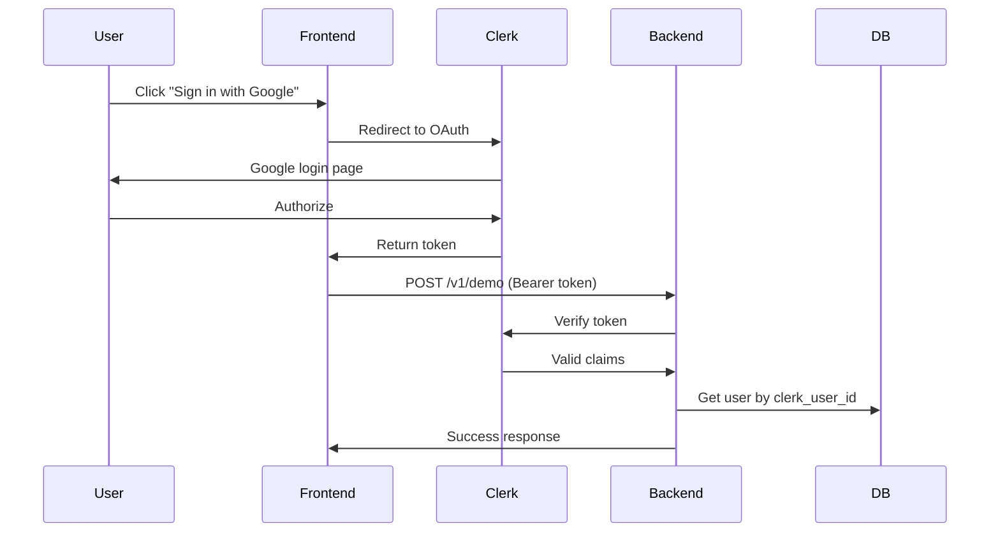
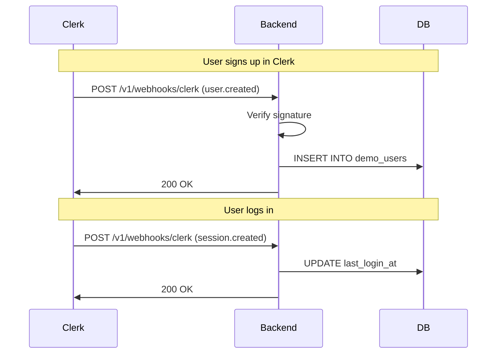

# Clerk API Usage Guide

Guía práctica para usar los endpoints de autenticación con Clerk en Odiseo Sales AI.

---

## Tabla de Contenidos

1. [Flujos de Autenticación](#flujos-de-autenticación)
2. [Endpoints Disponibles](#endpoints-disponibles)
3. [Ejemplos de Uso](#ejemplos-de-uso)
4. [Errores Comunes](#errores-comunes)
5. [Testing](#testing)

---

## Flujos de Autenticación

### Flujo 1: Autenticación con Clerk (Recomendado)



### Flujo 2: Webhooks de Sincronización



---

## Endpoints Disponibles

### 1. Obtener Usuario Actual

**Endpoint**: `GET /v1/auth/me`
**Autenticación**: Requerida (Bearer token)
**Descripción**: Obtiene información del usuario autenticado

#### Request

```bash
curl -X GET http://localhost:8082/v1/auth/me \
  -H "Authorization: Bearer <clerk_token>" \
  -H "Content-Type: application/json"
```

#### Response (Success 200)

```json
{
  "success": true,
  "user": {
    "id": 123,
    "clerk_user_id": "user_2abc123def456",
    "email": "juan.perez@empresa.com",
    "full_name": "Juan Pérez",
    "display_name": "Juan",
    "is_active": true,
    "is_email_verified": true,
    "clerk_metadata": {
      "public_metadata": {
        "company": "Acme Corp",
        "role": "Sales Manager"
      },
      "profile_image_url": "https://img.clerk.com/..."
    },
    "preferred_language": "es",
    "timezone": "America/Costa_Rica",
    "created_at": "2025-11-03T10:30:00Z",
    "last_login_at": "2025-11-04T09:15:00Z"
  }
}
```

#### Response (Error 401)

```json
{
  "success": false,
  "error": "Unauthorized",
  "message": "Missing Authorization header",
  "hint": "Include a valid Bearer token in the Authorization header"
}
```

---

### 2. Verificar Estado de Migración

**Endpoint**: `POST /v1/auth/check-migration`
**Autenticación**: No requerida
**Descripción**: Verifica si un usuario legacy necesita migrar a Clerk

#### Request

```bash
curl -X POST http://localhost:8082/v1/auth/check-migration \
  -H "Content-Type: application/json" \
  -d '{
    "email": "usuario.legacy@empresa.com"
  }'
```

#### Response (Usuario Requiere Migración)

```json
{
  "success": true,
  "requires_migration": true,
  "user_id": 456,
  "auth_provider": "email",
  "migration_status": "pending",
  "message": "Please log in with Clerk to migrate your account"
}
```

#### Response (Usuario Ya Migrado)

```json
{
  "success": true,
  "requires_migration": false,
  "message": "User already migrated or does not exist"
}
```

---

### 3. Webhook de Clerk

**Endpoint**: `POST /v1/webhooks/clerk`
**Autenticación**: Firma Svix en headers
**Descripción**: Recibe eventos de Clerk (user.created, user.updated, user.deleted, session.created)

#### Request Headers

```
svix-id: msg_2abc123def456
svix-timestamp: 1699999999
svix-signature: v1,signature_hash_here
Content-Type: application/json
```

#### Request Body (user.created)

```json
{
  "type": "user.created",
  "data": {
    "id": "user_2abc123def456",
    "email_addresses": [
      {
        "id": "email_abc123",
        "email_address": "maria.garcia@empresa.com"
      }
    ],
    "first_name": "María",
    "last_name": "García",
    "public_metadata": {
      "company": "TechCorp",
      "role": "CTO"
    },
    "created_at": 1699999999000
  }
}
```

#### Response (Success)

```json
{
  "success": true,
  "message": "Event user.created processed successfully",
  "event_id": "msg_2abc123def456"
}
```

---

### 4. Endpoint Demo con Clerk Auth

**Endpoint**: `POST /v1/demo`
**Autenticación**: Requerida (Bearer token)
**Descripción**: Procesa consultas del demo con autenticación Clerk

#### Request

```bash
curl -X POST http://localhost:8082/v1/demo \
  -H "Authorization: Bearer <clerk_token>" \
  -H "Content-Type: application/json" \
  -d '{
    "input": "¿Cuáles son los planes de precios disponibles?",
    "language": "es",
    "metadata": {
      "ip": "203.0.113.42",
      "user_agent": "Mozilla/5.0...",
      "fingerprint": "hash123"
    }
  }'
```

**Nota**: Ya NO se requiere `user_id` en el body. El middleware de Clerk extrae automáticamente el usuario del token.

#### Response (Success)

```json
{
  "success": true,
  "response": "Ofrecemos 3 planes: Básico ($29/mes), Profesional ($79/mes) y Enterprise (contacto)...",
  "tokens_used": 180,
  "tokens_remaining": 4820,
  "warning": {
    "is_warning": false,
    "message": null,
    "percentage_used": 3.6
  },
  "session_id": "sess_abc123",
  "created_at": "2025-11-04T10:30:45Z"
}
```

---

## Ejemplos de Uso

### Ejemplo 1: Frontend React con Clerk

```typescript
import { useAuth, useUser } from "@clerk/clerk-react";

function DemoChat() {
  const { getToken } = useAuth();
  const { user } = useUser();

  const sendMessage = async (message: string) => {
    // Get Clerk session token
    const token = await getToken();

    // Call backend with Bearer token
    const response = await fetch("http://localhost:8082/v1/demo", {
      method: "POST",
      headers: {
        "Authorization": `Bearer ${token}`,
        "Content-Type": "application/json",
      },
      body: JSON.stringify({
        input: message,
        language: "es",
        metadata: {
          ip: window.clientInfo?.ip,
          user_agent: navigator.userAgent,
          fingerprint: await getFingerprint(),
        },
      }),
    });

    const data = await response.json();
    return data;
  };

  return (
    <div>
      <p>Logged in as: {user?.emailAddress}</p>
      <button onClick={() => sendMessage("Hola")}>Send Message</button>
    </div>
  );
}
```

### Ejemplo 2: Testing con cURL

```bash
# 1. Obtener token de Clerk (en desarrollo, desde Clerk Dashboard -> JWT Template)
TOKEN="eyJhbGciOiJSUzI1NiIsInR5cCI6IkpXVCJ9..."

# 2. Obtener información del usuario
curl -X GET http://localhost:8082/v1/auth/me \
  -H "Authorization: Bearer $TOKEN"

# 3. Enviar consulta al demo
curl -X POST http://localhost:8082/v1/demo \
  -H "Authorization: Bearer $TOKEN" \
  -H "Content-Type: application/json" \
  -d '{
    "input": "¿Tienen integración con CRM?",
    "language": "es",
    "metadata": {
      "ip": "203.0.113.42",
      "user_agent": "curl/7.68.0",
      "fingerprint": "test123"
    }
  }'
```

### Ejemplo 3: Python Client

```python
import requests

class ClerkAPIClient:
    def __init__(self, base_url: str, clerk_token: str):
        self.base_url = base_url
        self.headers = {
            "Authorization": f"Bearer {clerk_token}",
            "Content-Type": "application/json"
        }

    def get_current_user(self):
        """Get authenticated user info."""
        response = requests.get(
            f"{self.base_url}/v1/auth/me",
            headers=self.headers
        )
        return response.json()

    def send_demo_query(self, message: str, language: str = "es"):
        """Send query to demo endpoint."""
        response = requests.post(
            f"{self.base_url}/v1/demo",
            headers=self.headers,
            json={
                "input": message,
                "language": language,
                "metadata": {
                    "ip": "127.0.0.1",
                    "user_agent": "PythonClient/1.0",
                    "fingerprint": "python_test"
                }
            }
        )
        return response.json()

# Usage
client = ClerkAPIClient(
    base_url="http://localhost:8082",
    clerk_token="your_clerk_token_here"
)

user = client.get_current_user()
print(f"Logged in as: {user['user']['email']}")

result = client.send_demo_query("¿Qué es Odiseo?")
print(f"Response: {result['response']}")
```

---

## Errores Comunes

### Error 1: Missing Authorization Header

```json
{
  "success": false,
  "error": "Unauthorized",
  "message": "Missing Authorization header",
  "hint": "Include a valid Bearer token in the Authorization header"
}
```

**Solución**: Incluye el header `Authorization: Bearer <token>` en todas las requests a endpoints protegidos.

---

### Error 2: Token Expired

```json
{
  "success": false,
  "error": "Unauthorized",
  "message": "Authentication failed: Token expired"
}
```

**Solución**: Los tokens de Clerk expiran después de 1 hora. Obtén un nuevo token usando `getToken()` de Clerk SDK.

---

### Error 3: Invalid Token Signature

```json
{
  "success": false,
  "error": "Unauthorized",
  "message": "Authentication failed: Invalid token: Signature verification failed"
}
```

**Solución**:
- Verifica que `CLERK_PUBLISHABLE_KEY` y `CLERK_SECRET_KEY` en `.env` coincidan con tu aplicación en Clerk Dashboard
- Asegúrate de estar usando el token correcto (development vs production)

---

### Error 4: Account Not Active

```json
{
  "success": false,
  "error": "Forbidden",
  "message": "Account is inactive. Contact support for assistance."
}
```

**Solución**: El usuario existe pero está desactivado en la base de datos. Contacta al administrador.

---

### Error 5: Webhook Signature Verification Failed

```json
{
  "success": false,
  "error": "Invalid webhook signature"
}
```

**Solución**:
- Verifica que `CLERK_WEBHOOK_SECRET` en `.env` coincida con el signing secret en Clerk Dashboard -> Webhooks
- Asegúrate de que los headers Svix (`svix-id`, `svix-timestamp`, `svix-signature`) están presentes
- No modifiques el body del webhook antes de la verificación

---

## Testing

### Testing Local con ngrok

Para probar webhooks en desarrollo local:

```bash
# 1. Instalar ngrok
npm install -g ngrok

# 2. Exponer puerto local
ngrok http 8082

# 3. Copiar URL HTTPS generada (ej: https://abc123.ngrok.io)

# 4. Configurar en Clerk Dashboard:
# Webhooks -> Add Endpoint
# URL: https://abc123.ngrok.io/v1/webhooks/clerk
# Events: user.created, user.updated, user.deleted, session.created

# 5. Copiar Signing Secret y actualizar en .env:
# CLERK_WEBHOOK_SECRET=whsec_...

# 6. Reiniciar demo_agent
make restart-demo
```

### Testing de Endpoints

```bash
# Health check
curl http://localhost:8082/health

# Get user (con token válido)
TOKEN="your_clerk_token"
curl -X GET http://localhost:8082/v1/auth/me \
  -H "Authorization: Bearer $TOKEN"

# Demo query (con token válido)
curl -X POST http://localhost:8082/v1/demo \
  -H "Authorization: Bearer $TOKEN" \
  -H "Content-Type: application/json" \
  -d '{"input": "Test query", "language": "es", "metadata": {"ip": "127.0.0.1", "user_agent": "curl", "fingerprint": "test"}}'
```

---

## Roadmap

### Features Implementados ✅

- [x] Middleware de autenticación Clerk
- [x] Validación de JWT con JWKS
- [x] Webhooks de sincronización (user.created, user.updated, user.deleted, session.created)
- [x] Endpoint `/v1/auth/me` para obtener usuario actual
- [x] Endpoint `/v1/auth/check-migration` para usuarios legacy
- [x] Integración con `/v1/demo` (Bearer token)
- [x] Soft delete idempotente
- [x] Schema dinámico (multi-environment)

### Features Pendientes 🔜

- [ ] Frontend integration con Clerk React SDK
- [ ] Rate limiting por usuario (actualmente por IP)
- [ ] Refresh token handling
- [ ] Multi-tenancy support (organization_id)
- [ ] Analytics de uso por usuario

---

**Documentado por**: Claude Code
**Fecha**: 2025-11-04
**Versión**: 1.0.0
**Proyecto**: Odiseo Sales AI - Clerk Integration
