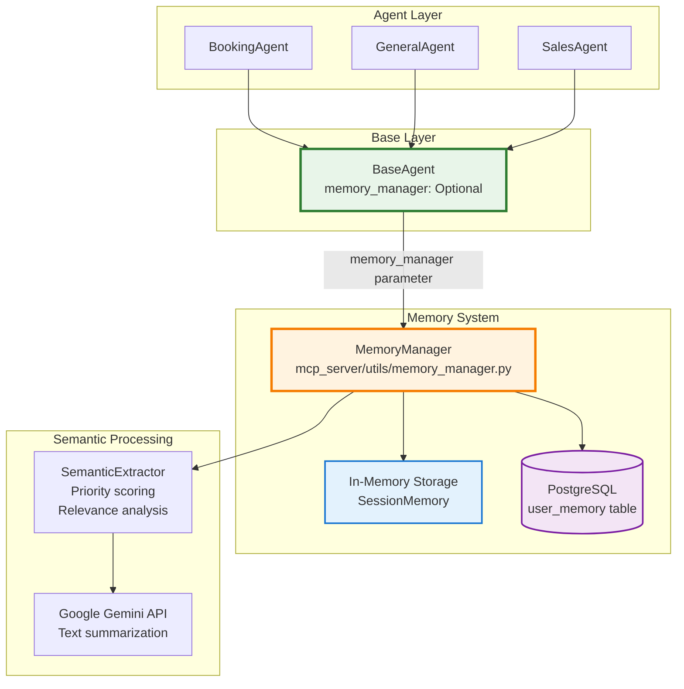

# Guía de Activación de Memoria - Sistema Multi-Agente

**Versión**: 1.0
**Fecha**: 2025-10-13
**Ámbito**: Agent System (BookingAgent, GeneralAgent, SalesAgent)

---

## 📋 Tabla de Contenidos

1. [Resumen Ejecutivo](#resumen-ejecutivo)
2. [Arquitectura de Memoria](#arquitectura-de-memoria)
3. [Activación por Componente](#activación-por-componente)
4. [Ejemplos de Uso](#ejemplos-de-uso)
5. [Configuración Avanzada](#configuración-avanzada)
6. [Troubleshooting](#troubleshooting)
7. [Referencias](#referencias)

---

## 🎯 Resumen Ejecutivo

El sistema multi-agente de Lab01-MCP implementa un sistema de **memoria persistente híbrida** (RAM + PostgreSQL) basado en el patrón **Memory Blocks** de Letta/MemGPT.

**Estado Actual**: La memoria está **deshabilitada por defecto** en todos los agentes.

**Este documento explica cómo activarla en cada componente.**

---

## 🏗️ Arquitectura de Memoria

### Componentes del Sistema



### Características del Sistema de Memoria

| Característica | Descripción | Implementación |
|----------------|-------------|----------------|
| **Persistencia Híbrida** | RAM (sesión) + PostgreSQL (cross-session) | `SessionMemory` + `user_memory` table |
| **Semantic Extraction** | Extracción automática de hechos relevantes | `SemanticExtractor` + Gemini API |
| **Priority Scoring** | Scoring de importancia (0-10) | Basado en keywords, emociones, acciones |
| **TTL Management** | Expiración automática de memorias | `default_ttl_days=30` configurable |
| **Memory Types** | `fact`, `preference`, `context`, `action` | Clasificación automática |

### Ubicación de Archivos Clave

```
Lab01-MCP/
├── mcp_server/utils/
│   ├── memory_manager.py          # Sistema principal de memoria
│   └── semantic_extractor.py      # Extracción semántica de hechos
├── agent/src/gemini_agent/
│   └── base_agent.py              # BaseAgent con soporte de memoria
├── agent/src/multi_agent/
│   ├── booking_agent.py           # BookingAgent (hereda BaseAgent)
│   ├── general_agent.py           # GeneralAgent (hereda BaseAgent)
│   └── sales_agent.py             # SalesAgent (hereda BaseAgent)
└── SQL/migrations/
    └── 20250112_add_user_memory.sql  # Schema de user_memory table
```

---

## ⚙️ Activación por Componente

### 1. BookingAgent (Agente de Reservas)

#### Ubicación del Archivo
`/home/javort/Lab01-MCP/agent/src/multi_agent/booking_agent.py:172`

#### Estado Actual (Deshabilitado)

```python
# agent/src/multi_agent/booking_agent.py

class BookingAgent(BaseAgent):
    def __init__(
        self,
        api_key: Optional[str] = None,
        model_name: Optional[str] = None,
        mcp_tools: Optional[List[types.FunctionDeclaration]] = None,
        session_id: Optional[str] = None,        # ← Parámetro existe
        memory_manager: Optional[Any] = None,    # ← Parámetro existe
        **kwargs: Any
    ):
        super().__init__(
            api_key=api_key,
            model_name=model_name,
            mcp_tools=mcp_tools,
            session_id=session_id,              # ← Se pasa a BaseAgent
            memory_manager=memory_manager,      # ← Se pasa a BaseAgent
            **kwargs
        )
        # Log actual muestra: Memory: ❌ Disabled
```

#### Activación de Memoria

**Opción 1: Uso Directo con MemoryManager**

```python
from multi_agent import BookingAgent
from mcp_server.utils.memory_manager import MemoryManager

# 1. Inicializar MemoryManager
memory = MemoryManager()

# 2. Crear o recuperar sesión
session_id = memory.get_or_create_session(
    customer_email="customer@example.com"
)

# 3. Inicializar BookingAgent CON memoria
agent = BookingAgent(
    session_id=session_id,
    memory_manager=memory,
    mcp_tools=booking_tools  # Si necesita herramientas MCP
)

# 4. Inicializar agente
await agent.initialize()

# ✅ Log ahora muestra: Memory: ✅ Enabled (session: abc123...)
```

**Opción 2: Uso Simplificado con get_or_create_session**

```python
# Recuperar sesión existente o crear nueva automáticamente
session_id = memory.get_or_create_session(
    customer_email="customer@example.com"
)

# Crear agente (get_or_create_session maneja ambos casos)
agent = BookingAgent(session_id=session_id, memory_manager=memory)
```

**Opción 3: Uso con AgentFactory**

```python
from multi_agent import AgentFactory
from mcp_server.utils.memory_manager import MemoryManager

memory = MemoryManager()
session_id = memory.get_or_create_session(customer_email="user@example.com")

# Crear agent con factory
agent = await AgentFactory.create(
    "booking",
    mcp_tools=tools,
    session_id=session_id,
    memory_manager=memory
)
```

#### Verificación de Activación

```python
# El log durante initialize() debe mostrar:
# [INFO] BookingAgent initialized:
#   - Session ID: abc12345-xxxx-xxxx-xxxx-xxxxxxxxxxxx
#   - Memory: ✅ Enabled (session: abc123...)  ← Antes: ❌ Disabled
#   - Model: gemini-2.5-flash
#   - MCP Tools: 7 tools
```

---

### 2. GeneralAgent (Agente General/FAQ)

#### Ubicación del Archivo
`/home/javort/Lab01-MCP/agent/src/multi_agent/general_agent.py:172`

#### Estado Actual (Deshabilitado)

El código es idéntico a BookingAgent en estructura:

```python
class GeneralAgent(BaseAgent):
    def __init__(
        self,
        api_key: Optional[str] = None,
        model_name: Optional[str] = None,
        session_id: Optional[str] = None,        # ← Parámetro existe
        memory_manager: Optional[Any] = None,    # ← Parámetro existe
        **kwargs: Any
    ):
        super().__init__(
            api_key=api_key,
            model_name=model_name,
            session_id=session_id,
            memory_manager=memory_manager,
            **kwargs
        )
```

#### Activación de Memoria

**Uso típico para FAQ/General queries:**

```python
from multi_agent import GeneralAgent
from mcp_server.utils.memory_manager import MemoryManager

# 1. Inicializar sistema de memoria
memory = MemoryManager()

# 2. Crear sesión para usuario
session_id = memory.create_session(
    customer_email="user@example.com",
    metadata={"agent_type": "general", "use_case": "faq"}
)

# 3. Crear agente general con memoria
agent = GeneralAgent(
    session_id=session_id,
    memory_manager=memory
)

# 4. Inicializar
await agent.initialize()

# ✅ Log: Memory: ✅ Enabled (session: xyz789...)
```

**Caso de uso: Contexto cross-pregunta**

```python
# Primera pregunta
response1 = await agent.generate_response(
    "¿Cuál es su horario de atención?",
    customer_email="user@example.com"
)

# Segunda pregunta (con contexto de memoria)
response2 = await agent.generate_response(
    "¿Puedo ir mañana a esa hora?",  # "esa hora" referencia memoria previa
    customer_email="user@example.com"
)
# ✅ GeneralAgent recuerda el horario mencionado anteriormente
```

---

### 3. SalesAgent (Agente de Ventas)

#### Ubicación del Archivo
`/home/javort/Lab01-MCP/agent/src/multi_agent/sales_agent.py:172`

#### Estado Actual (Deshabilitado)

Estructura idéntica:

```python
class SalesAgent(BaseAgent):
    def __init__(
        self,
        api_key: Optional[str] = None,
        model_name: Optional[str] = None,
        mcp_tools: Optional[List[types.FunctionDeclaration]] = None,
        session_id: Optional[str] = None,        # ← Parámetro existe
        memory_manager: Optional[Any] = None,    # ← Parámetro existe
        **kwargs: Any
    ):
        super().__init__(
            api_key=api_key,
            model_name=model_name,
            mcp_tools=mcp_tools,
            session_id=session_id,
            memory_manager=memory_manager,
            **kwargs
        )
```

#### Activación de Memoria

**Uso típico para ventas y recomendaciones:**

```python
from multi_agent import SalesAgent
from mcp_server.utils.memory_manager import MemoryManager

# 1. Inicializar memoria
memory = MemoryManager()

# 2. Crear sesión
session_id = memory.create_session(
    customer_email="customer@store.com",
    metadata={"agent_type": "sales", "channel": "web"}
)

# 3. Crear agente de ventas con memoria
agent = SalesAgent(
    session_id=session_id,
    memory_manager=memory,
    mcp_tools=product_search_tools  # Herramientas de búsqueda de productos
)

# 4. Inicializar
await agent.initialize()

# ✅ Log: Memory: ✅ Enabled (session: def456...)
```

**Caso de uso: Preferencias persistentes del cliente**

```python
# Primera interacción - cliente menciona preferencias
response1 = await agent.generate_response(
    "Busco laptops gaming, prefiero marca ASUS",
    customer_email="customer@store.com"
)
# ✅ SalesAgent guarda: preference="ASUS", category="laptops gaming"

# --- Cliente regresa días después ---

# Nueva sesión pero MISMA memoria (get_or_create_session recupera la sesión existente)
session_id = memory.get_or_create_session(customer_email="customer@store.com")
agent = SalesAgent(session_id=session_id, memory_manager=memory)

response2 = await agent.generate_response(
    "¿Tienes nuevas laptops?",
    customer_email="customer@store.com"
)
# ✅ SalesAgent recuerda: "Tienes preferencia por ASUS gaming laptops"
# ✅ Prioriza productos ASUS en recomendaciones
```

---

## 📚 Ejemplos de Uso

### Ejemplo 1: Flujo Completo con BookingAgent

```python
import asyncio
from multi_agent import BookingAgent
from mcp_server.utils.memory_manager import MemoryManager

async def booking_with_memory():
    # Paso 1: Inicializar sistema de memoria
    memory = MemoryManager()

    # Paso 2: Obtener o crear sesión para cliente
    customer_email = "juan.perez@email.com"
    session_id = memory.get_or_create_session(
        customer_email=customer_email
    )

    # Paso 3: Crear agente con memoria
    agent = BookingAgent(
        session_id=session_id,
        memory_manager=memory,
        mcp_tools=booking_tools
    )

    # Paso 4: Inicializar
    await agent.initialize()
    print(f"✅ BookingAgent inicializado con memoria: {session_id}")

    try:
        # Paso 5: Primera conversación
        response1 = await agent.generate_response(
            "Quiero reservar una cita para corte de cabello",
            customer_email=customer_email
        )
        print(f"Agente: {response1}")

        # Paso 6: Seguimiento (con contexto de memoria)
        response2 = await agent.generate_response(
            "¿Cuánto cuesta ese servicio?",  # "ese servicio" = contexto previo
            customer_email=customer_email
        )
        print(f"Agente: {response2}")

        # Paso 7: Ver memorias guardadas
        memories = memory.get_memories(
            customer_email=customer_email,
            limit=10
        )
        print(f"\n📝 Memorias guardadas: {len(memories)}")
        for mem in memories:
            print(f"  - [{mem.memory_type}] {mem.content} (priority: {mem.priority_score})")

    finally:
        # Paso 8: Cleanup
        await agent.cleanup()

if __name__ == "__main__":
    asyncio.run(booking_with_memory())
```

**Salida Esperada:**

```
✅ BookingAgent inicializado con memoria: abc12345-xxxx-xxxx-xxxx-xxxxxxxxxxxx
Agente: Claro, puedo ayudarte a reservar un corte de cabello. ¿Qué día y hora te gustaría?
Agente: El servicio de corte de cabello tiene un costo de $15.00.

📝 Memorias guardadas: 2
  - [preference] Cliente interesado en servicio de corte de cabello (priority: 8)
  - [fact] Cliente consultó precio del servicio corte de cabello: $15 (priority: 7)
```

---

### Ejemplo 2: Multi-Agent System con Memoria Compartida

```python
from multi_agent import AgentFactory
from mcp_server.utils.memory_manager import MemoryManager

async def multi_agent_conversation():
    memory = MemoryManager()
    customer_email = "maria@example.com"

    # Sesión compartida entre agentes
    session_id = memory.get_or_create_session(
        customer_email=customer_email
    )

    # --- Agente 1: SalesAgent ---
    sales_agent = await AgentFactory.create(
        "sales",
        mcp_tools=product_tools,
        session_id=session_id,
        memory_manager=memory
    )

    response1 = await sales_agent.generate_response(
        "Busco una laptop para diseño gráfico",
        customer_email=customer_email
    )
    print(f"[SalesAgent]: {response1}")
    # ✅ Guarda: preference="diseño gráfico", category="laptops"

    await sales_agent.cleanup()

    # --- Agente 2: BookingAgent (misma sesión) ---
    booking_agent = await AgentFactory.create(
        "booking",
        mcp_tools=booking_tools,
        session_id=session_id,  # ← Misma sesión
        memory_manager=memory    # ← Misma memoria
    )

    response2 = await booking_agent.generate_response(
        "Quiero agendar una demo del producto",
        customer_email=customer_email
    )
    print(f"[BookingAgent]: {response2}")
    # ✅ BookingAgent accede a memoria de SalesAgent
    # ✅ Sabe que el cliente busca laptop para diseño gráfico

    await booking_agent.cleanup()

asyncio.run(multi_agent_conversation())
```

---

## 🔧 Configuración Avanzada

### Configuración del MemoryManager

```python
from mcp_server.utils.memory_manager import MemoryManager

# Configuración por defecto
memory = MemoryManager()

# Configuración personalizada (si se implementa en settings.py)
memory = MemoryManager(
    default_ttl_days=60,         # Memorias expiran en 60 días (default: 30)
    semantic_threshold=0.75,      # Threshold para extracción semántica (default: 0.8)
    auto_summarize=True,          # Auto-resumir conversaciones largas (default: True)
    enable_cross_session=True     # Memoria cross-session (default: True)
)
```

### Gestión Manual de Memorias

```python
# Agregar memoria manual
memory.add_memory(
    customer_email="user@example.com",
    content="Cliente prefiere productos con garantía extendida",
    memory_type="preference",
    priority_score=9,
    ttl_days=90
)

# Buscar memorias por query
relevant_memories = memory.search_memories(
    customer_email="user@example.com",
    query="preferencias de garantía",
    limit=5
)

# Eliminar memorias antiguas manualmente
deleted_count = memory.cleanup_expired_memories()
print(f"Eliminadas {deleted_count} memorias expiradas")

# Borrar todas las memorias de un cliente (GDPR compliance)
memory.delete_user_memories(customer_email="user@example.com")
```

### Mantenimiento Automático (Cron Job)

```bash
# Configurar cron para limpieza automática
# Ver: /home/javort/Lab01-MCP/scripts/cleanup_expired_memories.py

# Agregar a crontab:
# Ejecutar diariamente a las 2:00 AM
0 2 * * * cd /home/javort/Lab01-MCP && python scripts/cleanup_expired_memories.py

# O usar script de auto-sync (sincronización cross-session)
0 */6 * * * cd /home/javort/Lab01-MCP && python scripts/auto_sync_cron.py
```

---

## 🐛 Troubleshooting

### Problema 1: Log sigue mostrando "Memory: ❌ Disabled"

**Causa**: `session_id` o `memory_manager` no se pasó correctamente al constructor.

**Solución**:

```python
# ❌ Incorrecto
agent = BookingAgent()  # Sin parámetros

# ✅ Correcto
agent = BookingAgent(
    session_id=session_id,      # ← OBLIGATORIO
    memory_manager=memory       # ← OBLIGATORIO
)
```

### Problema 2: Error "no such table: user_memory"

**Causa**: Schema de memoria no está inicializado en PostgreSQL.

**Solución**:

```bash
# Ejecutar migración de memoria
cd /home/javort/Lab01-MCP/SQL
python src/run_user_memory_migration.py

# O inicializar manualmente
cd /home/javort/Lab01-MCP/SQL
python src/init_memory_system.py
```

### Problema 3: Memorias no persisten entre sesiones

**Causa**: Cada vez se crea una nueva sesión en lugar de recuperar la existente.

**Solución**:

```python
# ✅ Correcto - get_or_create_session maneja ambos casos automáticamente
session_id = memory.get_or_create_session(customer_email="user@example.com")
# Este método:
# - Si existe sesión para ese email → la recupera
# - Si NO existe → crea una nueva
```

### Problema 4: "ImportError: cannot import name 'MemoryManager'"

**Causa**: PYTHONPATH no incluye `mcp_server`.

**Solución**:

```bash
# Opción 1: Agregar al PYTHONPATH
export PYTHONPATH=/home/javort/Lab01-MCP:$PYTHONPATH

# Opción 2: Ejecutar desde project root
cd /home/javort/Lab01-MCP
python -c "from mcp_server.utils.memory_manager import MemoryManager; print('OK')"
```

### Problema 5: Performance lento con muchas memorias

**Causa**: Índices de base de datos faltantes o tabla `user_memory` muy grande.

**Solución**:

```sql
-- 1. Verificar índices
\d test.user_memory

-- 2. Crear índices si faltan
CREATE INDEX IF NOT EXISTS idx_user_memory_email ON test.user_memory(customer_email);
CREATE INDEX IF NOT EXISTS idx_user_memory_session ON test.user_memory(session_id);
CREATE INDEX IF NOT EXISTS idx_user_memory_expires ON test.user_memory(expires_at);

-- 3. Limpiar memorias expiradas
DELETE FROM test.user_memory WHERE expires_at < NOW();

-- 4. VACUUM para recuperar espacio
VACUUM ANALYZE test.user_memory;
```

---

## 📖 Referencias

### Archivos Relacionados

| Archivo | Descripción | Línea de Interés |
|---------|-------------|------------------|
| `agent/src/gemini_agent/base_agent.py` | BaseAgent con soporte de memoria | Línea 40-45 (constructor) |
| `agent/src/multi_agent/booking_agent.py` | BookingAgent | Línea 172 (log de memoria) |
| `agent/src/multi_agent/general_agent.py` | GeneralAgent | Línea 172 (log de memoria) |
| `agent/src/multi_agent/sales_agent.py` | SalesAgent | Línea 172 (log de memoria) |
| `mcp_server/utils/memory_manager.py` | Sistema principal de memoria | Todo el archivo |
| `mcp_server/utils/semantic_extractor.py` | Extracción semántica | Todo el archivo |
| `SQL/migrations/20250112_add_user_memory.sql` | Schema de memoria | SQL migration |

### Documentación Adicional

- **Agent Development Guide**: `/home/javort/Lab01-MCP/agent/docs/README_AGENTS.md`
  - Sección: "Creating Your First Agent" (no incluye memoria actualmente)

- **BaseAgent Implementation**: `/home/javort/Lab01-MCP/agent/src/gemini_agent/base_agent.py`
  - Constructor con `session_id` y `memory_manager` parameters

- **Memory CLI Tool**: `/home/javort/Lab01-MCP/scripts/odiseo_memory.py`
  - Herramienta de línea de comandos para gestión de memoria

### Tests de Referencia

```bash
# Tests de memoria disponibles
/home/javort/Lab01-MCP/test_memory_manager.py
/home/javort/Lab01-MCP/test_base_agent_memory.py
/home/javort/Lab01-MCP/test_cross_session_memory.py
/home/javort/Lab01-MCP/test_memory_improvements.py
/home/javort/Lab01-MCP/test_semantic_extraction.py

# Ejecutar tests
cd /home/javort/Lab01-MCP
pytest test_memory_manager.py -v
pytest test_base_agent_memory.py -v
```

---

## 📝 Checklist de Activación

Use este checklist para verificar la activación correcta de memoria:

### Pre-requisitos
- [ ] PostgreSQL está corriendo
- [ ] Tabla `user_memory` existe (ejecutar migración si es necesario)
- [ ] PYTHONPATH incluye `/home/javort/Lab01-MCP`

### Código
- [ ] Importar `MemoryManager` desde `mcp_server.utils.memory_manager`
- [ ] Crear instancia de `MemoryManager()`
- [ ] Llamar `memory.create_session()` o `memory.resume_session()`
- [ ] Pasar `session_id` y `memory_manager` al constructor del agente
- [ ] Llamar `await agent.initialize()`

### Verificación
- [ ] Log muestra `Memory: ✅ Enabled (session: ...)`
- [ ] Log **NO** muestra `Memory: ❌ Disabled`
- [ ] Memorias se guardan en base de datos (verificar con `memory.get_memories()`)
- [ ] Memoria persiste entre sesiones (probar con `resume_session()`)

---

## 🎓 Mejores Prácticas

### DO ✅

1. **Usar `get_or_create_session()` para gestión automática de sesiones**
   ```python
   session_id = memory.get_or_create_session(customer_email=email)
   ```

2. **Hacer cleanup al terminar**
   ```python
   try:
       response = await agent.generate_response(query)
   finally:
       await agent.cleanup()
   ```

3. **Usar metadata descriptiva en sesiones**
   ```python
   session_id = memory.create_session(
       customer_email=email,
       metadata={
           "agent_type": "booking",
           "channel": "web",
           "campaign": "summer2025"
       }
   )
   ```

4. **Monitorear uso de memoria**
   ```python
   memories = memory.get_memories(customer_email=email)
   print(f"Cliente tiene {len(memories)} memorias activas")
   ```

### DON'T ❌

1. **No crear nueva sesión cada vez**
   ```python
   # ❌ Malo - pierde historial
   session_id = memory.create_session(customer_email=email)

   # ✅ Bueno - mantiene historial
   session_id = memory.resume_session(customer_email=email)
   ```

2. **No usar session_id sin memory_manager**
   ```python
   # ❌ Malo - session_id sin memoria
   agent = BookingAgent(session_id="abc123")

   # ✅ Bueno - ambos parámetros
   agent = BookingAgent(session_id=session_id, memory_manager=memory)
   ```

3. **No ignorar errores de inicialización**
   ```python
   # ❌ Malo
   try:
       await agent.initialize()
   except Exception:
       pass  # Silenciosamente ignora errores

   # ✅ Bueno
   try:
       await agent.initialize()
   except Exception as e:
       logger.error(f"Error inicializando agente: {e}")
       raise
   ```

---

## 🔄 Actualizaciones Futuras

Este documento será actualizado cuando:

- Se agreguen nuevos agentes al sistema multi-agente
- Se implementen nuevas características de memoria (ej: embeddings de memoria)
- Se cambien parámetros de configuración del `MemoryManager`
- Se agreguen nuevos casos de uso documentados

**Última actualización**: 2025-10-13
**Siguiente revisión**: 2025-11-13

---

## 📞 Soporte

Para preguntas sobre activación de memoria:

1. Revisar esta guía completa
2. Verificar tests de referencia en `/test_*_memory.py`
3. Revisar implementación en `base_agent.py` y `memory_manager.py`
4. Abrir issue en GitHub con tag `memory-system`

---

**Fin del documento**
